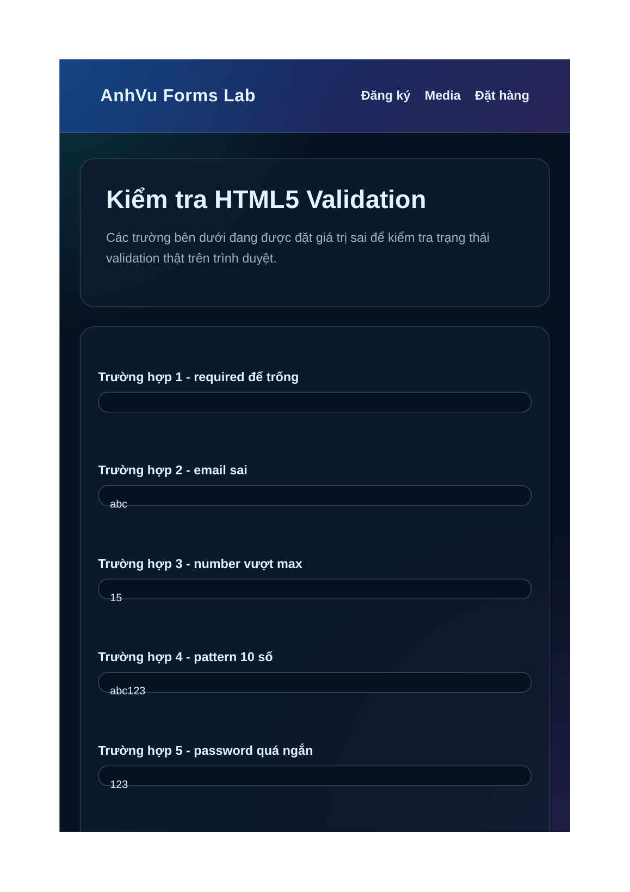
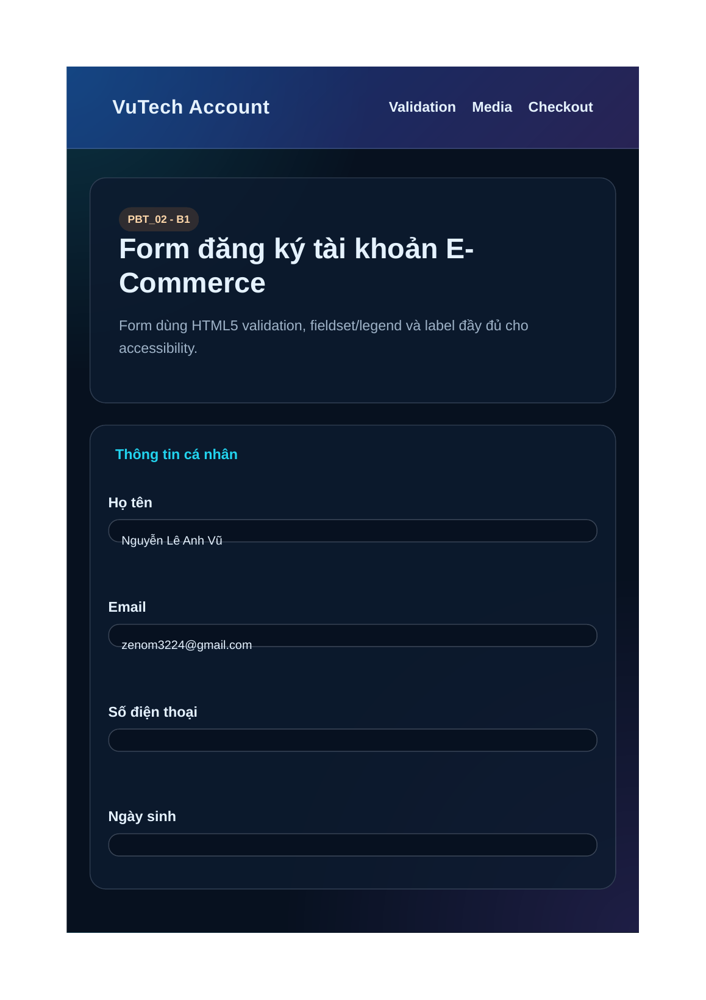
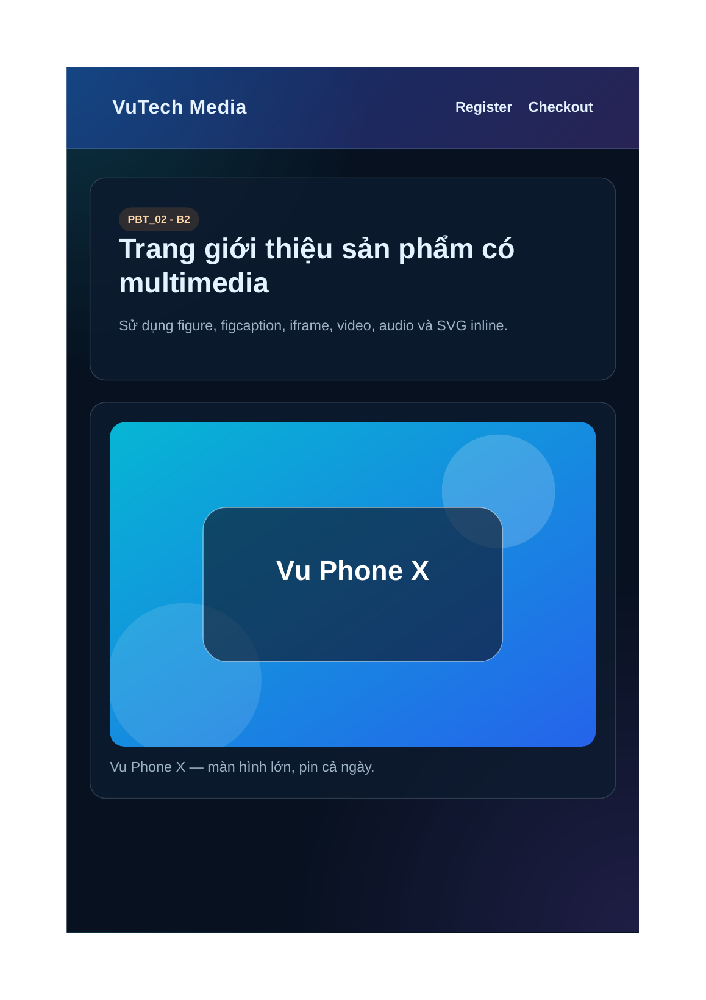
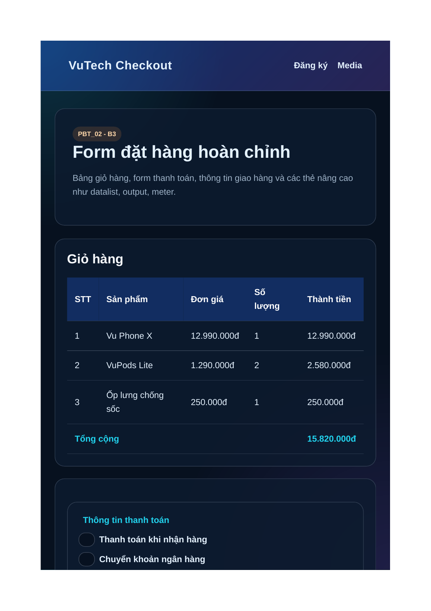
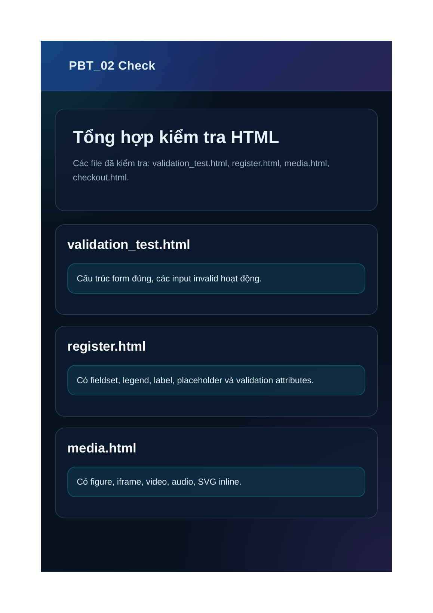

# PBT_02 - HTML5 Forms & Media

**Họ tên:** Nguyễn Lê Anh Vũ  
**Mã sinh viên:** 2451160853

## PHẦN A - KIỂM TRA ĐỌC HIỂU

### Câu A1 - Input Types

1. `type="email"` → Ô nhập email, tự kiểm tra có định dạng email → Dùng cho form đăng ký tài khoản.
2. `type="password"` → Ô nhập mật khẩu, ký tự bị ẩn → Dùng cho form đăng nhập/đăng ký.
3. `type="text"` → Ô nhập văn bản thường → Dùng cho họ tên, username, mã giảm giá.
4. `type="tel"` → Ô nhập số điện thoại, thuận tiện trên điện thoại → Dùng cho thông tin giao hàng.
5. `type="number"` → Ô nhập số, có thể dùng `min`, `max`, `step` → Dùng cho số lượng sản phẩm.
6. `type="date"` → Bộ chọn ngày → Dùng cho ngày sinh hoặc ngày giao hàng.
7. `type="checkbox"` → Ô tích chọn → Dùng cho đồng ý điều khoản hoặc chọn dịch vụ thêm.
8. `type="radio"` → Chọn một trong nhiều lựa chọn → Dùng cho phương thức thanh toán.
9. `type="range"` → Thanh kéo giá trị → Dùng cho chọn thời gian giao hàng dự kiến.
10. `type="file"` → Chọn file tải lên → Dùng cho upload ảnh đại diện hoặc ảnh chuyển khoản.

### Câu A2 - Validation Attributes

Trường hợp 1: `required value=""` sẽ không submit được vì trường bắt buộc đang bị bỏ trống.

Trường hợp 2: `type="email" value="abc"` sẽ báo lỗi vì `abc` không đúng định dạng email.

Trường hợp 3: `type="number" min="1" max="10" value="15"` sẽ báo lỗi vì 15 lớn hơn giá trị tối đa 10.

Trường hợp 4: `pattern="[0-9]{10}" value="abc123"` sẽ báo lỗi vì giá trị nhập không phải đúng 10 chữ số.

Trường hợp 5: `minlength="8" value="123"` sẽ báo lỗi vì mật khẩu chỉ có 3 ký tự, chưa đạt tối thiểu 8 ký tự.

Kết quả kiểm chứng trong file `validation_test.html`:



So với dự đoán, các trường nhập sai đều bị trình duyệt coi là không hợp lệ. HTML5 validation giúp chặn submit trước khi dữ liệu sai được gửi đi.

### Câu A3 - Accessibility

`<label for="email">` quan trọng vì nó giúp người dùng biết rõ ô input đang nhập dữ liệu gì. Với screen reader, label được đọc kèm input, nên người dùng khiếm thị vẫn hiểu mục đích của trường nhập. Ngoài ra khi bấm vào label, con trỏ cũng được focus vào input tương ứng.

`<fieldset>` và `<legend>` dùng khi cần nhóm các trường liên quan với nhau. Ví dụ trong form đăng ký có thể nhóm "Thông tin cá nhân", "Tài khoản", "Thông tin giao hàng" để form rõ ràng hơn.

`aria-label` dùng cho phần tử tương tác không có chữ hiển thị, ví dụ nút chỉ có icon giỏ hàng. Nếu đã có `<label>` rõ ràng thì không nên dùng thêm `aria-label` vì có thể làm nội dung đọc bởi screen reader bị lặp hoặc không thống nhất.

### Câu A4 - Media

`loading="lazy"` trên thẻ `` giúp ảnh chỉ tải khi gần xuất hiện trong vùng nhìn thấy. Cách này cải thiện tốc độ tải trang ban đầu vì trình duyệt không cần tải tất cả ảnh ngay từ đầu. Không nên dùng lazy loading cho ảnh quan trọng ở đầu trang như logo hoặc ảnh hero chính, vì có thể làm ảnh xuất hiện chậm.

Nên cung cấp nhiều `<source>` trong thẻ `<video>` vì không phải trình duyệt nào cũng hỗ trợ cùng một định dạng. Các format video web phổ biến gồm MP4, WebM và Ogg.

Alt tốt cho từng trường hợp:

- Ảnh sản phẩm iPhone 16: `alt="iPhone 16 màu titan, mặt trước và cụm camera sau"`
- Ảnh trang trí: `alt=""`
- Ảnh biểu đồ doanh thu Q1/2026: `alt="Biểu đồ doanh thu Q1/2026 tăng từ tháng 1 đến tháng 3"`

### Câu A5 - So sánh figure và img

Cách 1 chỉ dùng `` phù hợp khi ảnh là một phần đơn giản trong nội dung, không cần chú thích riêng. Ví dụ ảnh logo trong header hoặc icon minh họa nhỏ.

Cách 2 dùng `<figure>` và `<figcaption>` phù hợp khi ảnh có ý nghĩa độc lập và cần chú thích đi kèm. Ví dụ ảnh sản phẩm có tên và giá, hoặc ảnh biểu đồ cần ghi chú nguồn dữ liệu.

Ví dụ dùng ``:

1. Logo website ở header.
2. Icon xe giao hàng trong phần cam kết dịch vụ.

Ví dụ dùng `<figure>`:

1. Ảnh sản phẩm trong trang chi tiết sản phẩm.
2. Ảnh minh họa bài viết có caption giải thích.

## PHẦN B - THỰC HÀNH CODE

### Bài B1 - Form đăng ký tài khoản

File thực hiện: `register.html`

Form có đủ 3 nhóm thông tin: thông tin cá nhân, tài khoản và thông tin giao hàng. Các input đều có label, placeholder và validation attributes như `required`, `minlength`, `maxlength`, `pattern`, `max`.



HTML không thể tự validate xác nhận mật khẩu có khớp với mật khẩu chính hay không, vì HTML chỉ kiểm tra từng input độc lập theo pattern, required, minlength. Muốn so sánh hai input với nhau thì cần JavaScript.

### Bài B2 - Trang Multimedia

File thực hiện: `media.html`

Trang có 3 ảnh sản phẩm dùng `<figure>` và `<figcaption>`, có `alt` rõ ràng và `loading="lazy"`. Trang cũng có iframe YouTube, thẻ video, thẻ audio và SVG inline.



### Bài B3 - Form đặt hàng hoàn chỉnh

File thực hiện: `checkout.html`

Trang có bảng giỏ hàng dùng `<table>`, có `<thead>`, `<tbody>`, `<tfoot>` và `colspan`. Form thanh toán có radio, mã giảm giá theo pattern `SALE` + 4 số, textarea ghi chú, ngày giao hàng, select khung giờ, range, datalist, output và meter.



Kết quả kiểm tra tổng quan các file HTML:



## PHẦN C - PHÂN TÍCH & SUY LUẬN

### Câu C1 - Debug Form

Lỗi 1: Input tên không có `<label for="...">` nên không tốt cho accessibility.  
Sửa: `<label for="name">Tên:</label> <input type="text" id="name" name="name" required placeholder="Nguyễn Văn A">`

Lỗi 2: Input tên thiếu `name`, khi submit form sẽ khó gửi dữ liệu lên server.  
Sửa: thêm `name="name"`.

Lỗi 3: Input email không có label.  
Sửa: `<label for="email">Email:</label> <input type="email" id="email" name="email" required placeholder="email@example.com">`

Lỗi 4: Input password không có label, không có required và minlength.  
Sửa: thêm label, `required`, `minlength="8"`.

Lỗi 5: Input nhập lại mật khẩu không có label và không có name rõ ràng.  
Sửa: thêm `id="confirmPassword"`, `name="confirmPassword"`, label tương ứng.

Lỗi 6: Phone đang dùng `type="text"` thay vì `type="tel"`.  
Sửa: `<input type="tel" id="phone" name="phone" pattern="[0-9]{10}" placeholder="0901234567">`

Lỗi 7: Select không có label, id, name và option mặc định.  
Sửa: thêm label, `id="city"`, `name="city"`, option `value=""`.

Lỗi 8: Label điều khoản không chứa checkbox.  
Sửa: `<label><input type="checkbox" name="agree" required> Tôi đồng ý điều khoản</label>`

Bản sửa:

```html
<form action="#" method="POST">
    <label for="name">Tên:</label>
    <input type="text" id="name" name="name" required placeholder="Nguyễn Văn A">

    <label for="email">Email:</label>
    <input type="email" id="email" name="email" required placeholder="email@example.com">

    <label for="password">Mật khẩu:</label>
    <input type="password" id="password" name="password" required minlength="8" placeholder="Tối thiểu 8 ký tự">

    <label for="confirmPassword">Nhập lại mật khẩu:</label>
    <input type="password" id="confirmPassword" name="confirmPassword" required minlength="8" placeholder="Nhập lại mật khẩu">

    <label for="phone">Phone:</label>
    <input type="tel" id="phone" name="phone" pattern="[0-9]{10}" placeholder="0901234567">

    <label for="city">Thành phố:</label>
    <select id="city" name="city" required>
        <option value="">-- Chọn thành phố --</option>
        <option value="hanoi">Hà Nội</option>
        <option value="hcm">TP.HCM</option>
    </select>

    <label>
        <input type="checkbox" name="agree" required>
        Tôi đồng ý điều khoản
    </label>

    <button type="submit">Gửi</button>
</form>
```

### Câu C2 - Thiết kế chiến lược Validation

Pattern cho CMND/CCCD đúng 12 chữ số:

```html
<input type="text" pattern="[0-9]{12}" required>
```

Pattern cho số tài khoản 10 đến 15 chữ số:

```html
<input type="text" pattern="[0-9]{10,15}" required>
```

PIN đúng 6 chữ số và không hiển thị:

```html
<input type="password" pattern="[0-9]{6}" required>
```

HTML5 validation chưa đủ an toàn cho ứng dụng ngân hàng. Lý do là người dùng có thể tắt validation trên trình duyệt, sửa HTML bằng DevTools hoặc gửi request giả trực tiếp lên server. Validation ở frontend chỉ giúp trải nghiệm người dùng tốt hơn, không thể thay thế backend validation.

3 loại validation HTML5 không thể làm tốt:

1. Kiểm tra email đã tồn tại trong hệ thống hay chưa.
2. Kiểm tra mật khẩu xác nhận có trùng với mật khẩu chính hay không.
3. Kiểm tra dữ liệu theo logic nghiệp vụ phức tạp, ví dụ tuổi phải đủ 18 và CCCD phải khớp hồ sơ ngân hàng.

2 rủi ro nếu chỉ validate frontend:

1. Kẻ tấn công có thể bỏ qua form và gửi dữ liệu sai trực tiếp lên API.
2. Dữ liệu độc hại có thể đi vào database, gây lỗi hệ thống hoặc lỗ hổng bảo mật như injection, spam tài khoản.
