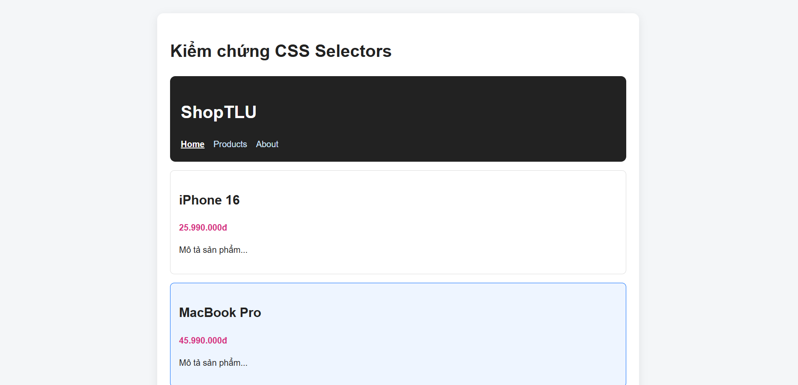
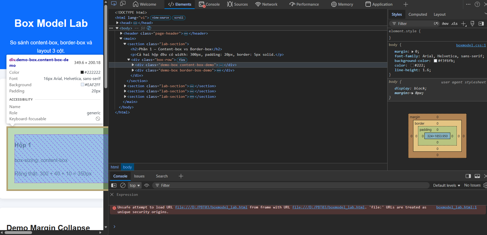
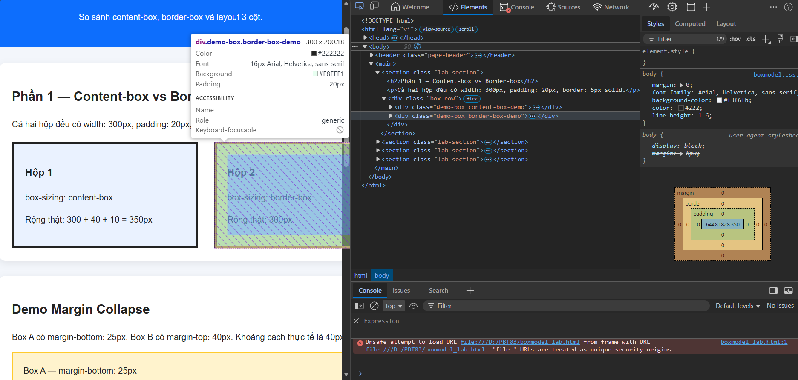
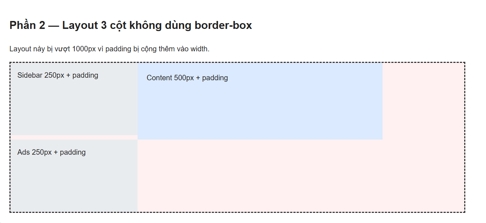
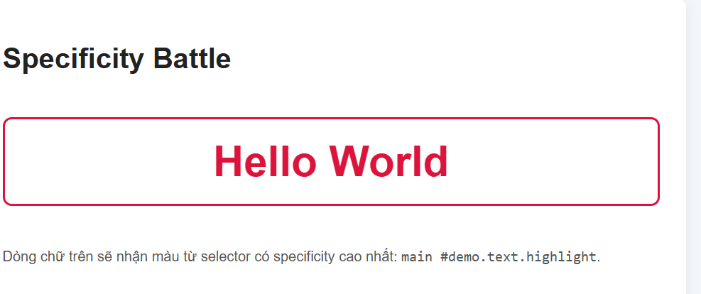
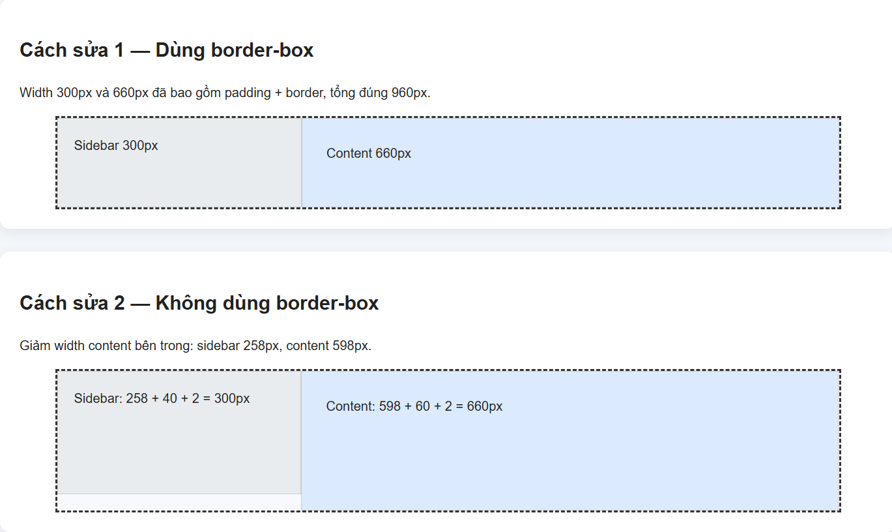
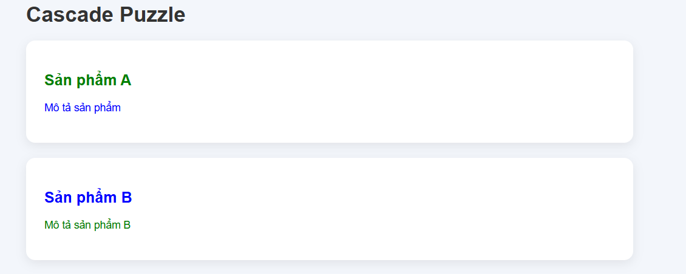

# PHIẾU BÀI TẬP 03 — CSS CORE

> Chủ đề: Selectors, Box Model, Inheritance & Cascade

---

## PHẦN A — KIỂM TRA ĐỌC HIỂU

## Câu A1 — 3 cách nhúng CSS

### 1. Inline CSS

**Ví dụ:**

```html
<p style="color: red; font-size: 18px;">Đây là đoạn văn dùng inline CSS</p>
```

**Ưu điểm:**

- Viết nhanh, dễ thử nghiệm một thuộc tính nhỏ.
- Tác động trực tiếp lên đúng element cần sửa.

**Nhược điểm:**

- Khó quản lý khi dự án lớn.
- Làm HTML bị rối.
- Khó tái sử dụng.
- Không tách biệt nội dung HTML và phần trình bày CSS.

**Khi nào nên dùng:**

- Khi cần test nhanh.
- Khi cần sửa tạm thời một element duy nhất.
- Không nên dùng thường xuyên trong dự án thật.

---

### 2. Internal CSS

**Ví dụ:**

```html
<!DOCTYPE html>
<html lang="vi">
<head>
    <meta charset="UTF-8">
    <title>Internal CSS</title>
    <style>
        p {
            color: blue;
            font-size: 18px;
        }
    </style>
</head>
<body>
    <p>Đây là đoạn văn dùng internal CSS</p>
</body>
</html>
```

**Ưu điểm:**

- Viết CSS trực tiếp trong file HTML, dễ demo.
- Phù hợp với trang nhỏ, bài tập nhỏ.
- Không cần tạo file CSS riêng.

**Nhược điểm:**

- Không tái sử dụng tốt cho nhiều trang.
- Nếu HTML dài thì phần `<style>` làm file khó đọc.
- Không tối ưu cho dự án nhiều trang.

**Khi nào nên dùng:**

- Khi làm ví dụ nhỏ.
- Khi làm bài demo nhanh.
- Khi chỉ có một file HTML đơn giản.

---

### 3. External CSS

**Ví dụ:**

File `index.html`:

```html
<!DOCTYPE html>
<html lang="vi">
<head>
    <meta charset="UTF-8">
    <title>External CSS</title>
    <link rel="stylesheet" href="style.css">
</head>
<body>
    <p>Đây là đoạn văn dùng external CSS</p>
</body>
</html>
```

File `style.css`:

```css
p {
    color: green;
    font-size: 18px;
}
```

**Ưu điểm:**

- Tách riêng HTML và CSS rõ ràng.
- Dễ quản lý, dễ bảo trì.
- Có thể dùng chung một file CSS cho nhiều trang HTML.
- Phù hợp với dự án thực tế.

**Nhược điểm:**

- Cần tạo thêm file `.css`.
- Nếu đường dẫn sai thì CSS không được áp dụng.

**Khi nào nên dùng:**

- Khi làm website nhiều trang.
- Khi làm dự án cần bảo trì lâu dài.
- Khi muốn code sạch, chuyên nghiệp hơn.

---

### Câu hỏi thêm

Nếu cùng một element có cả inline, internal và external CSS cùng áp dụng, thông thường **inline CSS sẽ thắng** vì inline style có độ ưu tiên cao hơn CSS viết trong thẻ `<style>` và CSS viết trong file external.

Ví dụ:

```html
<p style="color: orange;">Hello CSS</p>
```

Dù external hoặc internal có viết:

```css
p {
    color: red;
}
```

thì đoạn văn vẫn có màu **orange** do inline style ưu tiên cao hơn.

Lưu ý: nếu có `!important`, quy tắc ưu tiên có thể thay đổi.

---

## Câu A2 — CSS Selectors

HTML đề bài:

```html
<div id="app">
    <header class="top-bar dark">
        <h1>ShopTLU</h1>
        <nav>
            <a href="/" class="active">Home</a>
            <a href="/products">Products</a>
            <a href="/about">About</a>
        </nav>
    </header>
    <main>
        <article class="product">
            <h2>iPhone 16</h2>
            <p class="price">25.990.000đ</p>
            <p>Mô tả sản phẩm...</p>
        </article>
        <article class="product featured">
            <h2>MacBook Pro</h2>
            <p class="price">45.990.000đ</p>
            <p>Mô tả sản phẩm...</p>
        </article>
    </main>
</div>
```

| STT | Selector | Element được chọn |
|---|---|---|
| 1 | `h1` | `ShopTLU` |
| 2 | `.price` | `25.990.000đ`, `45.990.000đ` |
| 3 | `#app header` | Toàn bộ thẻ `header`, chứa `ShopTLU`, `Home`, `Products`, `About` |
| 4 | `nav a:first-child` | Link đầu tiên trong `nav`: `Home` |
| 5 | `.product.featured h2` | `MacBook Pro` |
| 6 | `article > p` | Các thẻ `p` là con trực tiếp của `article`: `25.990.000đ`, `Mô tả sản phẩm...`, `45.990.000đ`, `Mô tả sản phẩm...` |
| 7 | `a[href="/"]` | Link có `href="/"`: `Home` |
| 8 | `.top-bar.dark h1` | `ShopTLU` |

File kiểm chứng: `selectors_test.html`.

**Screenshot kiểm chứng:**



---

## Câu A3 — Box Model

### Trường hợp 1: `content-box`

```css
.box-1 {
    width: 400px;
    padding: 20px;
    border: 5px solid black;
    margin: 10px;
}
```

Vì mặc định `box-sizing: content-box`, thuộc tính `width: 400px` chỉ tính phần **content**.

Công thức:

```text
Chiều rộng hiển thị = width + padding trái + padding phải + border trái + border phải
```

Tính:

```text
400 + 20 + 20 + 5 + 5 = 450px
```

**Chiều rộng hiển thị:** `450px`

**Không gian chiếm trên trang:**

```text
450 + margin trái + margin phải = 450 + 10 + 10 = 470px
```

**Không gian chiếm trên trang:** `470px`

---

### Trường hợp 2: `border-box`

```css
.box-2 {
    box-sizing: border-box;
    width: 400px;
    padding: 20px;
    border: 5px solid black;
    margin: 10px;
}
```

Với `box-sizing: border-box`, `width: 400px` đã bao gồm cả **content + padding + border**.

**Chiều rộng hiển thị:** `400px`

Kích thước content thực tế:

```text
400 - 20 - 20 - 5 - 5 = 350px
```

**Kích thước content thực tế:** `350px`

Không gian chiếm trên trang:

```text
400 + margin trái + margin phải = 400 + 10 + 10 = 420px
```

**Không gian chiếm trên trang:** `420px`

---

### Trường hợp 3: Margin Collapse

```css
.box-a { margin-bottom: 25px; }
.box-b { margin-top: 40px; }
```

Với 2 block element nằm liên tiếp theo chiều dọc, margin dọc có thể bị **collapse**.

Khoảng cách giữa `.box-a` và `.box-b` không phải:

```text
25px + 40px = 65px
```

Mà trình duyệt lấy margin lớn hơn:

```text
max(25px, 40px) = 40px
```

**Khoảng cách thực tế:** `40px`

**Giải thích:** Vì margin dọc giữa hai block liền kề bị gộp lại, không cộng dồn.

Nâng cao:

```css
.box-a { margin-bottom: -10px; }
.box-b { margin-top: 40px; }
```

Khi một margin âm và một margin dương collapse với nhau:

```text
40 + (-10) = 30px
```

**Khoảng cách thực tế:** `30px`

---

## Câu A4 — Specificity

HTML:

```html
<p class="price" id="main-price">Giá sản phẩm</p>
```

CSS:

```css
p { color: black; }          /* Rule A */
.price { color: blue; }      /* Rule B */
#main-price { color: red; }  /* Rule C */
p.price { color: green; }    /* Rule D */
```

| Rule | Selector | Specificity `(a,b,c)` | Giải thích |
|---|---|---|---|
| A | `p` | `(0,0,1)` | Có 1 element selector |
| B | `.price` | `(0,1,0)` | Có 1 class selector |
| C | `#main-price` | `(1,0,0)` | Có 1 ID selector |
| D | `p.price` | `(0,1,1)` | Có 1 class và 1 element |

Element sẽ có màu **red** vì `#main-price` có specificity `(1,0,0)`, cao hơn class và element selector.

Nếu thêm inline style:

```html
<p class="price" id="main-price" style="color: orange;">Giá sản phẩm</p>
```

Element có màu **orange** vì inline style có độ ưu tiên cao hơn CSS thường trong file.

Nếu Rule A thêm `!important`:

```css
p { color: black !important; }
```

Element có màu **black**, vì declaration có `!important` sẽ ưu tiên hơn các declaration thường, kể cả inline style thường. Nếu inline style cũng có `!important` thì inline `!important` mới thắng.

---

# PHẦN B — THỰC HÀNH CODE

## Bài B1 — Style trang Profile

Đã tạo 2 file:

- `profile.html`
- `style.css`

Các loại selector đã dùng trong `style.css`:

| Loại selector | Ví dụ trong bài |
|---|---|
| Element selector | `body`, `header`, `table`, `footer` |
| Class selector | `.nav-link`, `.active`, `.profile-card` |
| ID selector | `#profile`, `#skills` |
| Descendant selector | `.profile-card h2`, `nav ul` |
| Pseudo-class selector | `.nav-link:hover`, `tbody tr:hover`, `tr:nth-child(even)` |

---

## Bài B2 — Box Model Lab

Đã tạo 2 file:

- `boxmodel_lab.html`
- `boxmodel.css`

Kết quả cần ghi sau khi mở DevTools:

### Phần 1

Hộp 1 dùng `content-box`:

```text
width thật = 300 + 20 + 20 + 5 + 5 = 350px
```

**Hộp 1 content-box:** chiều rộng thực tế = `350px`

Hộp 2 dùng `border-box`:

```text
width thật = 300px
```

**Hộp 2 border-box:** chiều rộng thực tế = `300px`

**Giải thích:**

- `content-box`: `width` chỉ tính phần content, nên padding và border được cộng thêm ra ngoài.
- `border-box`: `width` đã bao gồm content, padding và border, nên hộp không bị phình ra.

### Phần 2

Nếu không dùng `border-box`:

```text
Sidebar = 250 + 15 + 15 = 280px
Content = 500 + 20 + 20 = 540px
Ads = 250 + 15 + 15 = 280px
Tổng = 280 + 540 + 280 = 1100px
```

Vì `1100px > 1000px`, layout sẽ vượt container.

Nếu dùng `border-box`:

```text
Sidebar = 250px
Content = 500px
Ads = 250px
Tổng = 1000px
```

Layout vừa đúng container `1000px`.

**Screenshot DevTools — Hộp 1 content-box:**



**Screenshot DevTools — Hộp 2 border-box:**



**Screenshot layout 3 cột:**



---

## Bài B3 — Specificity Battle

Đã tạo 2 file:

- `specificity.html`
- `specificity.css`

HTML chính:

```html
<p id="demo" class="text highlight">Hello World</p>
```

10 rules trong file CSS được sắp xếp từ thấp đến cao:

| STT | Rule | Specificity | Màu |
|---|---|---|---|
| 1 | `p` | `(0,0,1)` | black |
| 2 | `.text` | `(0,1,0)` | blue |
| 3 | `.highlight` | `(0,1,0)` | green |
| 4 | `p.text` | `(0,1,1)` | orange |
| 5 | `.text.highlight` | `(0,2,0)` | purple |
| 6 | `.card .highlight` | `(0,2,0)` | brown |
| 7 | `section .text.highlight` | `(0,2,1)` | teal |
| 8 | `.container .card .text.highlight` | `(0,4,0)` | deeppink |
| 9 | `#demo` | `(1,0,0)` | red |
| 10 | `main #demo.text.highlight` | `(1,2,1)` | crimson |

Element cuối cùng hiển thị màu **crimson** vì rule cuối có specificity cao nhất: `(1,2,1)`.

Nếu thay đổi thứ tự các rule trong CSS file, kết quả **không đổi** nếu rule có specificity cao nhất vẫn là `main #demo.text.highlight`.

Tuy nhiên, nếu có nhiều rule cùng specificity, rule viết sau sẽ thắng rule viết trước.

**Screenshot kết quả:**



---

# PHẦN C — DEBUG & SUY LUẬN

## Câu C1 — Debug CSS Layout

CSS ban đầu:

```css
.container {
    width: 960px;
    margin: 0 auto;
}
.sidebar {
    width: 300px;
    padding: 20px;
    border: 1px solid #ccc;
    float: left;
}
.content {
    width: 660px;
    padding: 30px;
    border: 1px solid #ccc;
    float: left;
}
```

Vì mặc định là `content-box`, `width` chỉ tính phần content.

Chiều rộng thực tế của sidebar:

```text
300 + 20 + 20 + 1 + 1 = 342px
```

Chiều rộng thực tế của content:

```text
660 + 30 + 30 + 1 + 1 = 722px
```

Tổng chiều rộng:

```text
342 + 722 = 1064px
```

Trong khi container chỉ rộng `960px`.

Vì `1064px > 960px`, phần `.content` không đủ chỗ nằm cạnh `.sidebar`, nên nó bị đẩy xuống dòng mới.

---

### Cách sửa 1 — Dùng `border-box`

```css
.sidebar,
.content {
    box-sizing: border-box;
}

.sidebar {
    width: 300px;
    padding: 20px;
    border: 1px solid #ccc;
    float: left;
}

.content {
    width: 660px;
    padding: 30px;
    border: 1px solid #ccc;
    float: left;
}
```

Lúc này:

```text
Sidebar = 300px
Content = 660px
Tổng = 960px
```

Layout vừa đúng container.

---

### Cách sửa 2 — Không dùng `border-box`

Giữ `content-box`, nhưng giảm width phần content bên trong.

Sidebar cần hiển thị tổng `300px`:

```text
width content = 300 - 20 - 20 - 1 - 1 = 258px
```

Content cần hiển thị tổng `660px`:

```text
width content = 660 - 30 - 30 - 1 - 1 = 598px
```

CSS sửa:

```css
.sidebar {
    width: 258px;
    padding: 20px;
    border: 1px solid #ccc;
    float: left;
}

.content {
    width: 598px;
    padding: 30px;
    border: 1px solid #ccc;
    float: left;
}
```

Tổng thực tế:

```text
300 + 660 = 960px
```

File kiểm chứng:

- `debug_layout.html`
- `debug_layout.css`

**Screenshot kết quả sửa layout:**



---

## Câu C2 — Cascade Puzzle

CSS đề bài:

```css
body { font-size: 16px; color: #333; }
.container { font-size: 14px; }
.card { color: blue; }
.card .title { font-size: 20px; }
.card p { color: inherit; }
#featured .title { color: red; }
.highlight { color: green !important; }
```

HTML:

```html
<body>
    <div class="container">
        <div class="card" id="featured">
            <h2 class="title highlight">Sản phẩm A</h2>
            <p>Mô tả sản phẩm</p>
        </div>
        <div class="card">
            <h2 class="title">Sản phẩm B</h2>
            <p class="highlight">Mô tả sản phẩm B</p>
        </div>
    </div>
</body>
```

---

### 1. `Sản phẩm A` — thẻ `h2.title.highlight`

**Font-size:** `20px`

Vì rule:

```css
.card .title { font-size: 20px; }
```

áp dụng cho thẻ `h2` có class `title` nằm trong `.card`.

**Color:** `green`

Các rule liên quan:

```css
.card { color: blue; }
#featured .title { color: red; }
.highlight { color: green !important; }
```

- `.card` cho màu xanh dương, được kế thừa xuống con.
- `#featured .title` đặt màu đỏ trực tiếp cho title.
- `.highlight { color: green !important; }` đặt màu xanh lá và có `!important`.

Vì `!important` ưu tiên hơn rule thường, nên màu cuối cùng là **green**.

Kết quả:

```text
Sản phẩm A: font-size = 20px, color = green
```

---

### 2. `Mô tả sản phẩm` — thẻ `p` trong card có id `featured`

**Color:** `blue`

Các rule liên quan:

```css
.card { color: blue; }
.card p { color: inherit; }
```

Thẻ `p` nằm trong `.card`, nên nó kế thừa màu từ `.card`. `.card` có `color: blue`.

Rule:

```css
#featured .title { color: red; }
```

không ảnh hưởng vì nó chỉ chọn element có class `.title`, không chọn thẻ `p`.

Kết quả:

```text
Mô tả sản phẩm: color = blue
```

---

### 3. `Sản phẩm B` — thẻ `h2.title`

**Font-size:** `20px`

Vì có rule:

```css
.card .title { font-size: 20px; }
```

**Color:** `blue`

Thẻ `h2` này nằm trong `.card`, nên kế thừa:

```css
.card { color: blue; }
```

Nó không có class `.highlight`, nên không nhận màu xanh lá.

Kết quả:

```text
Sản phẩm B: font-size = 20px, color = blue
```

---

### 4. `Mô tả sản phẩm B` — thẻ `p.highlight`

**Color:** `green`

Các rule liên quan:

```css
.card { color: blue; }
.card p { color: inherit; }
.highlight { color: green !important; }
```

Ban đầu, `p` có thể kế thừa màu xanh dương từ `.card`.

Nhưng do thẻ `p` có class `.highlight`, nó nhận rule:

```css
.highlight { color: green !important; }
```

Vì có `!important`, màu cuối cùng là **green**.

Kết quả:

```text
Mô tả sản phẩm B: color = green
```

File kiểm chứng:

- `cascade_puzzle.html`
- `cascade_puzzle.css`

Screenshot kiểm chứng đã chèn:



---

# HƯỚNG DẪN CHỤP SCREENSHOT

## Chụp DevTools Box Model

1. Mở file `boxmodel_lab.html` bằng Chrome hoặc Edge.
2. Nhấn chuột phải vào hộp cần kiểm tra.
3. Chọn `Inspect`.
4. Chọn tab `Computed`.
5. Tìm phần Box Model diagram.
6. Chụp màn hình và lưu vào folder `screenshots/`.

Tên file gợi ý:

```text
screenshots/content-box-devtools.png
screenshots/border-box-devtools.png
screenshots/three-columns-broken.png
screenshots/three-columns-fixed.png
screenshots/specificity-result.png
screenshots/debug-layout.png
screenshots/C2_cascade_puzzle_result.png
```

---

# HƯỚNG DẪN GIT COMMIT

Mở terminal tại thư mục bài làm, chạy:

```bash
git init
git add answers.md
git commit -m "[PBT03] Add written answers"

git add selectors_test.html profile.html style.css
git commit -m "[PBT03] Add selector test and profile styling"

git add boxmodel_lab.html boxmodel.css specificity.html specificity.css
git commit -m "[PBT03] Add box model and specificity labs"

git add debug_layout.html debug_layout.css cascade_puzzle.html cascade_puzzle.css screenshots
git commit -m "[PBT03] Add debug layout, cascade puzzle and screenshots"
```

Nếu muốn đẩy lên GitHub:

```bash
git branch -M main
git remote add origin https://github.com/USERNAME/REPOSITORY.git
git push -u origin main
```

Thay `USERNAME` và `REPOSITORY` bằng tài khoản và tên repository của bạn.
