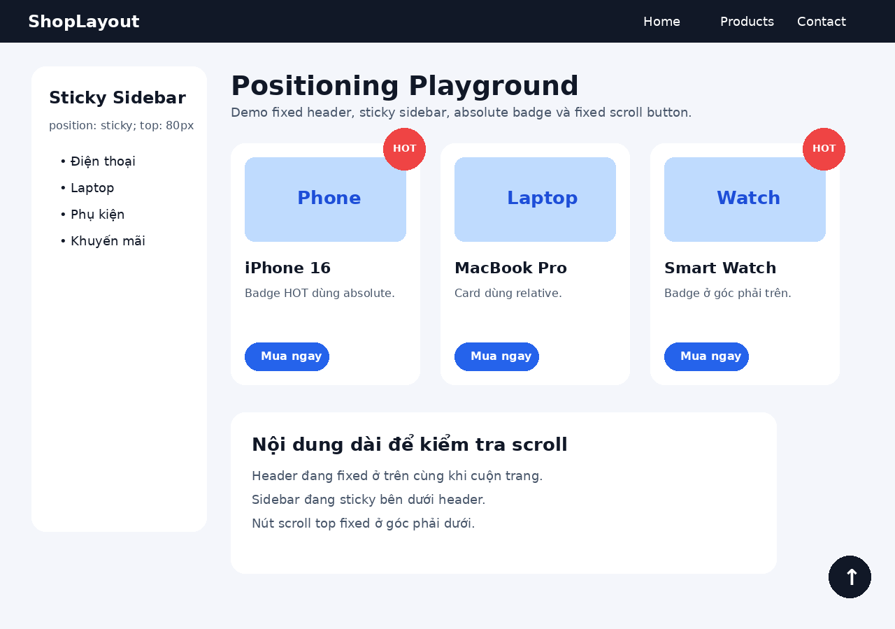
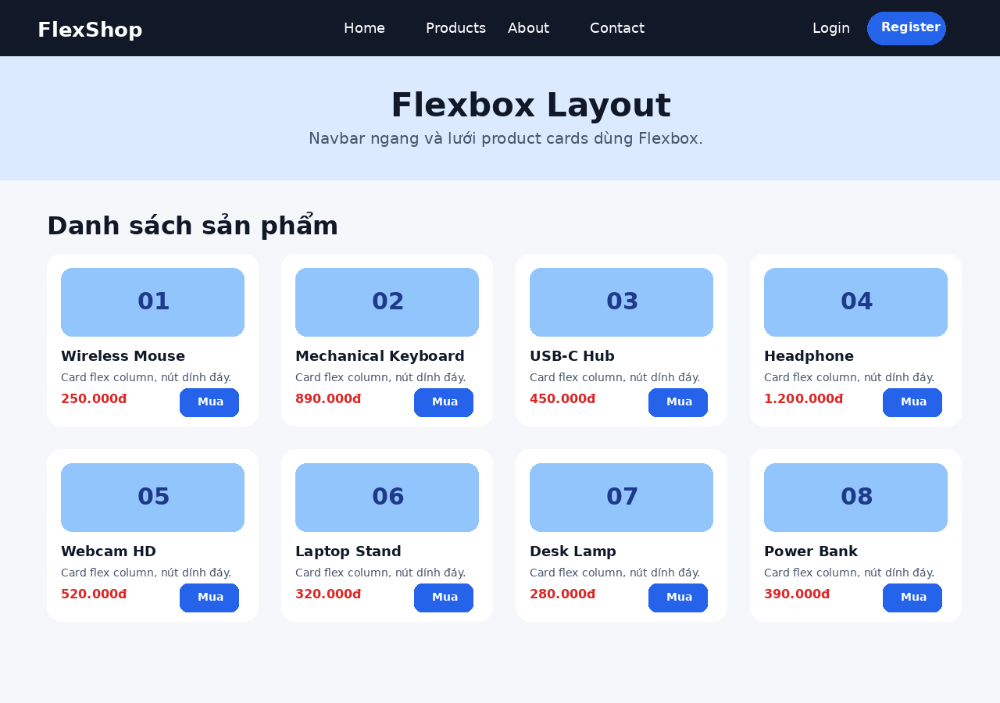
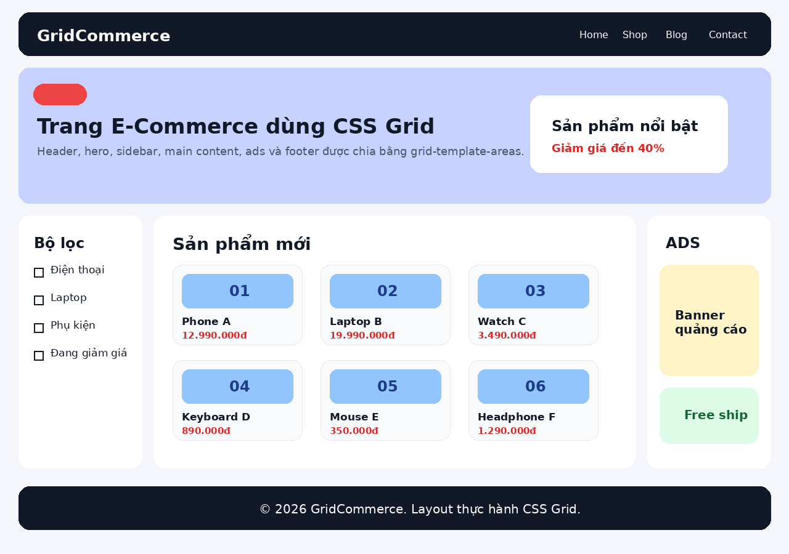
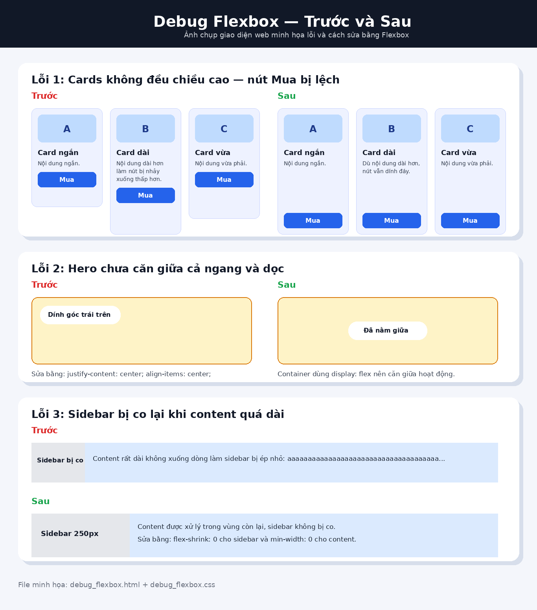

# PHIẾU BÀI TẬP 04 — CSS LAYOUT

> Chủ đề: Positioning, Flexbox & Grid  
> Ghi chú: Không làm phần video OBS theo yêu cầu.

---

# PHẦN A — KIỂM TRA ĐỌC HIỂU

## Câu A1 — 5 loại Positioning

| Position | Vẫn chiếm chỗ trong flow? | Tham chiếu vị trí | Cuộn theo trang? | Use case |
|---|---|---|---|---|
| `static` | Có | Theo flow bình thường của HTML | Có | Dùng mặc định cho phần tử, không cần chỉnh vị trí đặc biệt |
| `relative` | Có | Vị trí ban đầu của chính nó | Có | Dịch nhẹ phần tử so với vị trí ban đầu, hoặc làm mốc cho phần tử `absolute` bên trong |
| `absolute` | Không | Nearest positioned ancestor, nếu không có thì theo viewport/page gốc | Có, nếu nằm trong nội dung trang | Đặt badge, icon, popup nhỏ, nhãn nằm chính xác trong một khối cha |
| `fixed` | Không | Viewport trình duyệt | Không, luôn cố định khi scroll | Header cố định, nút scroll top, chat button |
| `sticky` | Có | Theo flow ban đầu, sau đó bám theo viewport khi đạt ngưỡng `top` | Có, nhưng sẽ dính khi scroll đến vị trí quy định | Sidebar dính, menu dính, tiêu đề bảng dính |

### Câu hỏi thêm

`absolute` sẽ tham chiếu theo **parent** nếu parent hoặc tổ tiên gần nhất của nó có `position` khác `static`, ví dụ: `relative`, `absolute`, `fixed`, hoặc `sticky`.

Khái niệm **nearest positioned ancestor** nghĩa là: trình duyệt sẽ đi từ phần tử `absolute` ngược lên các thẻ cha. Thẻ cha đầu tiên có `position` khác `static` sẽ được chọn làm mốc vị trí.

Ví dụ:

```css
.card {
    position: relative;
}
.badge {
    position: absolute;
    top: 10px;
    right: 10px;
}
```

Lúc này `.badge` sẽ nằm ở góc phải trên của `.card`.

Nếu không có thẻ cha nào được đặt `position`, phần tử `absolute` thường sẽ lấy mốc theo vùng gốc của trang.

---

## Câu A2 — Flexbox vs Grid

### Trường hợp 1

```css
.container { display: flex; }
.item { flex: 1; }
```

Có 4 items. Mỗi item có `flex: 1`, nên 4 item sẽ chia đều chiều ngang container thành 4 cột bằng nhau.

```text
+------+------+------+------+
|  1   |  2   |  3   |  4   |
+------+------+------+------+
```

---

### Trường hợp 2

```css
.container { display: flex; flex-wrap: wrap; }
.item { width: 45%; margin: 2.5%; }
```

Mỗi item chiếm:

```text
45% + 2.5% trái + 2.5% phải = 50%
```

Vì vậy mỗi hàng có 2 item. Có 6 item nên sẽ có 3 hàng, 2 cột.

```text
+---------+---------+
|    1    |    2    |
+---------+---------+
|    3    |    4    |
+---------+---------+
|    5    |    6    |
+---------+---------+
```

---

### Trường hợp 3

```css
.container {
    display: flex;
    justify-content: space-between;
    align-items: center;
}
```

Có 3 items. Các item nằm trên một hàng ngang. Item đầu nằm sát trái, item cuối sát phải, item giữa nằm ở giữa. `align-items: center` giúp các item căn giữa theo chiều dọc.

```text
+--------------------------------------+
|  1              2                 3  |
+--------------------------------------+
```

---

### Trường hợp 4

```css
.container {
    display: grid;
    grid-template-columns: 200px 1fr 200px;
    gap: 20px;
}
```

Có 3 item. Grid tạo 3 cột: cột trái 200px, cột giữa lấy phần còn lại, cột phải 200px. Giữa các cột có khoảng cách 20px.

```text
+--------+----------------------+--------+
| 200px  |         1fr          | 200px  |
+--------+----------------------+--------+
```

---

### Trường hợp 5

```css
.container {
    display: grid;
    grid-template-columns: repeat(3, 1fr);
    gap: 10px;
}
```

Grid có 3 cột bằng nhau. Có 7 items nên sẽ có 3 hàng. Hai hàng đầu đủ 3 item, item thứ 7 nằm ở hàng 3, cột 1.

```text
+-----+-----+-----+
|  1  |  2  |  3  |
+-----+-----+-----+
|  4  |  5  |  6  |
+-----+-----+-----+
|  7  |     |     |
+-----+-----+-----+
```

---

# PHẦN B — THỰC HÀNH CODE

## Bài B1 — Positioning Playground

Đã tạo:

- `positioning.html`
- `positioning.css`

Trang có đủ:

- Fixed header cao 60px, full width, nền đậm, chữ trắng.
- Logo bên trái, navigation bên phải.
- Sticky sidebar rộng 250px, dùng `position: sticky; top: 80px;`.
- Product card dùng `position: relative`.
- Badge `HOT` dùng `position: absolute` ở góc phải trên.
- Nút scroll to top dùng `position: fixed` ở góc phải dưới.

Screenshot minh họa:



---

## Bài B2 — Flexbox Navigation & Cards

Đã tạo:

- `flexbox_layout.html`
- `flexbox.css`

Trang có đủ:

- Navbar ngang bằng Flexbox.
- Logo bên trái.
- Menu ở giữa.
- Login/Register bên phải.
- Hover đổi màu và underline.
- Product cards dùng `display: flex; flex-wrap: wrap;`.
- Mỗi card dùng `flex: 0 0 calc(25% - 20px)`.
- Card bên trong dùng `flex-direction: column`.
- Nút mua dùng `margin-top: auto` để dính đáy card.
- Có 8 sản phẩm, chia 2 hàng.

Screenshot minh họa:



---

## Bài B3 — Grid Layout — Trang E-Commerce

Đã tạo:

- `grid_layout.html`
- `grid.css`

Trang có đủ:

- Layout chính dùng CSS Grid.
- `grid-template-columns: 200px minmax(0, 1fr) 200px`.
- Header, Hero và Footer span full width bằng `grid-column: 1 / -1`.
- Sidebar chứa filter checkboxes.
- Main content có grid con 3 cột cho product cards.
- Ads bên phải có banner quảng cáo.
- Có ít nhất 6 product cards.
- Có dùng `grid-template-areas`.
- Hero có card sản phẩm nổi bật dùng `grid-column: span 2`.

Screenshot minh họa:



---

# PHẦN C — SUY LUẬN

## Câu C1 — Flexbox vs Grid: Khi nào dùng gì?

| Tình huống | Nên dùng | Giải thích |
|---|---|---|
| Navigation bar ngang: logo + menu + buttons | Flexbox | Navbar chủ yếu là bố cục một chiều theo hàng ngang. Flexbox căn giữa dọc và chia khoảng cách rất tiện. |
| Lưới ảnh Instagram 3 cột đều nhau | Grid | Đây là bố cục hai chiều theo hàng và cột. Grid kiểm soát số cột tốt hơn. |
| Layout blog: main content + sidebar | Grid hoặc kết hợp | Bố cục chính có nhiều vùng nên Grid phù hợp. Bên trong từng vùng có thể dùng Flexbox. |
| Footer với 4 cột thông tin | Grid hoặc Flexbox | Nếu chỉ chia 4 cột đơn giản thì Flexbox được. Nếu muốn kiểm soát hàng/cột rõ hơn thì Grid tốt hơn. |
| Card sản phẩm: ảnh trên, text giữa, nút dưới | Flexbox | Card là bố cục một chiều theo cột. Dùng `flex-direction: column` và `margin-top: auto` để nút dính đáy. |

Kết luận ngắn:

- Flexbox phù hợp layout một chiều: ngang hoặc dọc.
- Grid phù hợp layout hai chiều: hàng và cột.
- Dự án thực tế thường kết hợp cả hai.

---

## Câu C2 — Debug Flexbox

Đã tạo file kiểm chứng:

- `debug_flexbox.html`
- `debug_flexbox.css`

Screenshot trước/sau:



---

### Lỗi 1: Cards không đều chiều cao, nút “Mua” bị nhảy lên/xuống

Code lỗi:

```css
.card-container { display: flex; flex-wrap: wrap; }
.card { width: 30%; margin: 1.5%; }
.card img { width: 100%; }
.card h3 { font-size: 18px; }
.card .btn { padding: 10px; }
```

**Nguyên nhân:**  
Nội dung trong mỗi card dài ngắn khác nhau. Card chưa được tổ chức theo cột bằng Flexbox, nên nút nằm ngay sau nội dung và bị lệch vị trí.

**Code sửa:**

```css
.card-container {
    display: flex;
    flex-wrap: wrap;
    gap: 20px;
}

.card {
    flex: 0 0 calc(33.333% - 20px);
    display: flex;
    flex-direction: column;
}

.card .btn {
    margin-top: auto;
    padding: 10px;
}
```

`margin-top: auto` đẩy nút xuống cuối card vì phần khoảng trống còn lại được đưa lên phía trên nút.

---

### Lỗi 2: Muốn item nằm giữa ngang và dọc nhưng vẫn dính góc trái trên

Code lỗi:

```css
.hero {
    height: 100vh;
    display: flex;
}
.hero-content {
    text-align: center;
}
```

**Nguyên nhân:**  
`display: flex` chỉ bật Flexbox, nhưng chưa có `justify-content` và `align-items` nên nội dung vẫn nằm ở đầu container.

**Code sửa:**

```css
.hero {
    height: 100vh;
    display: flex;
    justify-content: center;
    align-items: center;
}

.hero-content {
    text-align: center;
}
```

- `justify-content: center` căn giữa theo trục chính.
- `align-items: center` căn giữa theo trục phụ.

---

### Lỗi 3: Sidebar bị co lại khi content quá dài

Code lỗi:

```css
.layout { display: flex; }
.sidebar { width: 250px; }
.content { flex: 1; }
```

**Nguyên nhân:**  
Trong Flexbox, item có thể bị co lại theo mặc định do `flex-shrink: 1`. Vì vậy sidebar dù đặt `width: 250px` vẫn có thể bị co khi content quá dài.

**Code sửa:**

```css
.layout {
    display: flex;
}

.sidebar {
    width: 250px;
    flex-shrink: 0;
}

.content {
    flex: 1;
    min-width: 0;
}
```

- `flex-shrink: 0` giữ sidebar không bị co.
- `min-width: 0` giúp content được phép co trong vùng còn lại thay vì đẩy vỡ layout.

---

# Checklist nộp bài

```text
PBT_04/
├── answers.md
├── positioning.html
├── positioning.css
├── flexbox_layout.html
├── flexbox.css
├── grid_layout.html
├── grid.css
├── debug_flexbox.html
├── debug_flexbox.css
├── screenshots/
│   ├── B1_positioning_result.png
│   ├── B2_flexbox_result.png
│   ├── B3_grid_result.png
│   └── C2_debug_flexbox_result.png
└── GIT_COMMIT_GUIDE.md
```

Không nộp phần video OBS.
