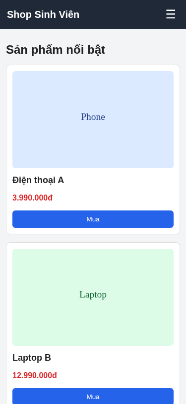
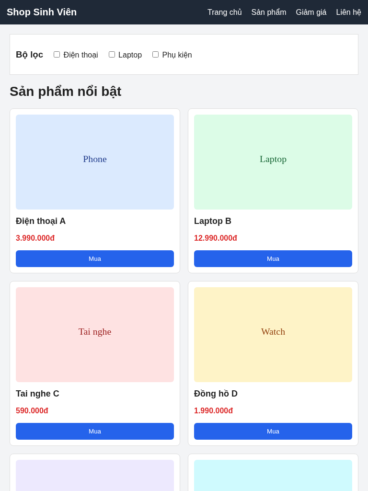
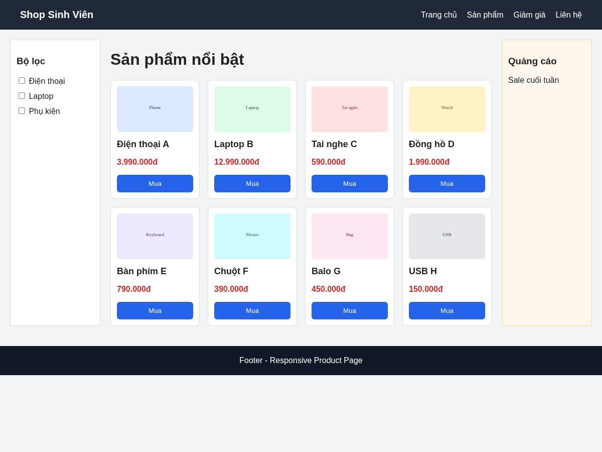
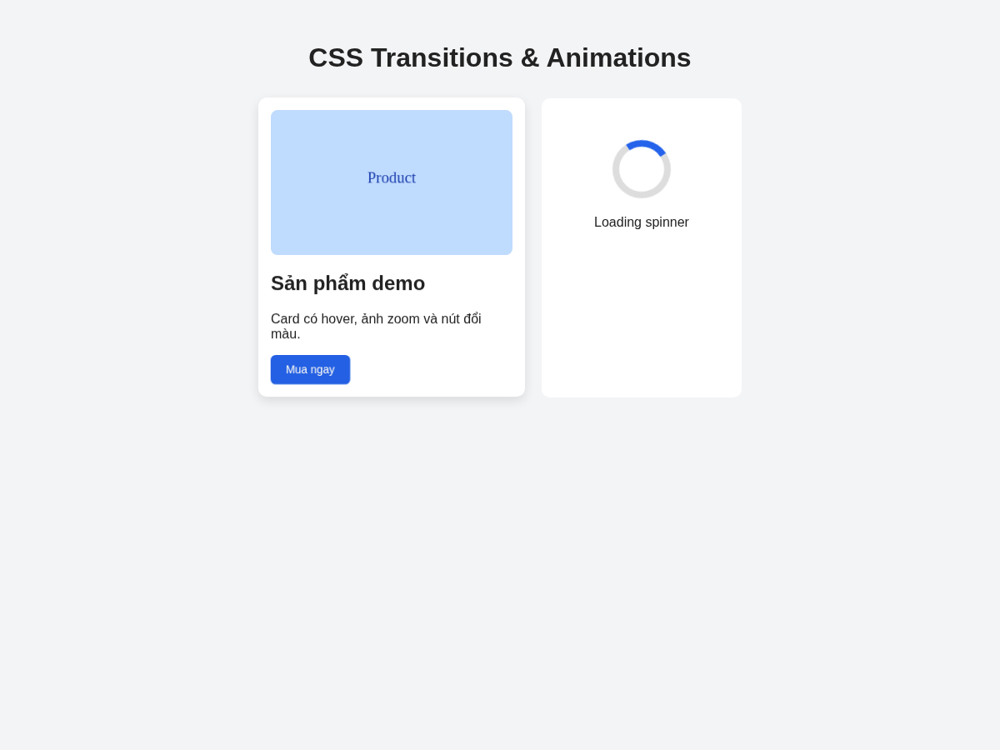

# PBT_05 — CSS Responsive & SCSS

---

# PHẦN A — KIỂM TRA ĐỌC HIỂU

## Câu A1 — Viewport & Mobile-First

Thẻ `meta viewport` chuẩn:

```html
<meta name="viewport" content="width=device-width, initial-scale=1.0">
```

Giải thích:

- `width=device-width`: chiều rộng của trang web sẽ bằng chiều rộng thật của thiết bị.
- `initial-scale=1.0`: mức zoom ban đầu của trang là 100%.

Nếu thiếu thẻ này, trên iPhone trang web thường bị hiển thị như một trang desktop bị thu nhỏ. Khi đó chữ, ảnh và các phần trong layout sẽ nhỏ, người dùng phải zoom thủ công mới đọc được.

### Mobile-First

Mobile-First là viết CSS mặc định cho màn hình nhỏ trước, sau đó dùng `@media (min-width: ...)` để mở rộng layout cho tablet và desktop.

Ví dụ:

```css
.product-grid {
    display: grid;
    grid-template-columns: 1fr;
}

@media (min-width: 768px) {
    .product-grid {
        grid-template-columns: repeat(2, 1fr);
    }
}
```

### Desktop-First

Desktop-First là viết CSS mặc định cho màn hình lớn trước, sau đó dùng `@media (max-width: ...)` để chỉnh lại cho màn hình nhỏ.

Ví dụ:

```css
.product-grid {
    display: grid;
    grid-template-columns: repeat(4, 1fr);
}

@media (max-width: 767px) {
    .product-grid {
        grid-template-columns: 1fr;
    }
}
```

Mobile-First được khuyên dùng vì hiện nay người dùng truy cập web bằng điện thoại rất nhiều. Ngoài ra, cách viết từ màn hình nhỏ lên màn hình lớn giúp CSS dễ kiểm soát hơn.

---

## Câu A2 — Breakpoints

| Breakpoint | Kích thước | Thiết bị đại diện | Lưới sản phẩm gợi ý |
|---|---:|---|---|
| XS | `< 576px` | Điện thoại nhỏ | 1 cột |
| SM | `≥ 576px` | Điện thoại lớn | 1 đến 2 cột |
| MD | `≥ 768px` | Tablet | 2 cột |
| LG | `≥ 992px` | Laptop nhỏ | 3 cột |
| XL | `≥ 1200px` | Desktop | 4 cột |
| XXL | `≥ 1400px` | Màn hình rất lớn | 4 đến 5 cột |

---

## Câu A3 — Media Queries

CSS đề bài:

```css
.container { width: 100%; padding: 10px; }

@media (min-width: 576px) { .container { width: 540px; } }
@media (min-width: 768px) { .container { width: 720px; } }
@media (min-width: 992px) { .container { width: 960px; } }
@media (min-width: 1200px) { .container { width: 1140px; } }
```

Bảng kết quả:

| Chiều rộng màn hình | `.container` width |
|---:|---:|
| 375px | `100%` |
| 600px | `540px` |
| 800px | `720px` |
| 1000px | `960px` |
| 1400px | `1140px` |

Giải thích: vì media query dùng `min-width`, nên khi màn hình đạt đến breakpoint nào thì rule ở breakpoint đó sẽ được áp dụng. Nếu màn hình càng rộng thì các rule phía dưới sẽ tiếp tục ghi đè rule phía trên.

---

## Câu A4 — SCSS Basics

SCSS là CSS có thêm các tính năng như biến, lồng selector, mixin và chia file. Trình duyệt không đọc trực tiếp file `.scss`, vì vậy cần compile SCSS thành CSS.

```text
SCSS → Compiler → CSS → Browser đọc
```

### 1. Variables

Variables dùng để lưu giá trị dùng lại nhiều lần.

```scss
$primary-color: #2563eb;
$radius: 8px;

.btn {
    background: $primary-color;
    border-radius: $radius;
}
```

Khi muốn đổi màu chính, chỉ cần sửa biến `$primary-color` một lần.

### 2. Nesting

Nesting giúp viết CSS lồng theo cấu trúc HTML.

```scss
.navbar {
    background: #111827;

    a {
        color: white;
        text-decoration: none;

        &:hover {
            text-decoration: underline;
        }
    }
}
```

Dấu `&` đại diện cho selector cha.

### 3. Mixins

Mixin giống như một hàm CSS để dùng lại.

```scss
@mixin flex-center {
    display: flex;
    justify-content: center;
    align-items: center;
}

.hero {
    @include flex-center;
}
```

### 4. @extend / Inheritance

`@extend` giúp một selector kế thừa style của selector khác.

```scss
.message {
    padding: 12px;
    border-radius: 6px;
}

.success {
    @extend .message;
    background: #dcfce7;
}
```

Trình duyệt không đọc được `.scss` vì đây chưa phải là CSS chuẩn. Cần dùng compiler để chuyển SCSS thành CSS, ví dụ:

```bash
sass scss/style.scss scss/style.css
```

---

# PHẦN B — THỰC HÀNH CODE

## Bài B1 — Responsive Product Page

Đã tạo file:

- `responsive.html`
- `responsive.css`

Trang được viết theo hướng Mobile-First:

- CSS mặc định dành cho mobile.
- `@media (min-width: 768px)` dành cho tablet.
- `@media (min-width: 1024px)` dành cho desktop.

Kết quả:

- Mobile: header có nút hamburger, grid sản phẩm 1 cột, sidebar bị ẩn.
- Tablet: menu ngang xuất hiện, filter nằm ngang, grid sản phẩm 2 cột.
- Desktop: có sidebar bên trái, product grid 4 cột và ads bar bên phải.

### Screenshot 375px



### Screenshot 768px



### Screenshot 1200px



---

## Bài B2 — CSS Transitions & Animations

Đã tạo file:

- `animations.html`
- `animations.css`

Các hiệu ứng đã làm:

1. Card hover: dùng `transform: translateY(-8px)` và tăng `box-shadow`.
2. Button hover: đổi màu nút và dùng `transform: scale(1.05)`.
3. Image zoom: ảnh sản phẩm phóng to khi hover vào card.
4. Loading spinner: dùng `@keyframes spin`.
5. Fade-in: dùng `@keyframes fadeIn`.

Screenshot kết quả:



---

## Bài B3 — SCSS Refactor

Đã tạo folder:

```text
scss/
├── _variables.scss
├── _mixins.scss
├── _components.scss
├── style.scss
└── style.css
```

Trong bài đã dùng các nội dung chính của SCSS:

### Variables

File `_variables.scss` có các biến như:

```scss
$primary-color: #2563eb;
$secondary-color: #f97316;
$text-color: #222;
$light-bg: #f3f4f6;
$white: #ffffff;
$font-primary: Arial, sans-serif;
$breakpoint-tablet: 768px;
$breakpoint-desktop: 1024px;
$spacing-sm: 8px;
$spacing-md: 16px;
$spacing-lg: 32px;
$radius: 8px;
```

### Mixins

File `_mixins.scss` có các mixin:

```scss
@mixin flex-center {
    display: flex;
    justify-content: center;
    align-items: center;
}

@mixin card-shadow {
    box-shadow: 0 4px 12px rgba(0, 0, 0, 0.12);
}

@mixin respond-to($breakpoint) {
    @if $breakpoint == tablet {
        @media (min-width: $breakpoint-tablet) { @content; }
    } @else if $breakpoint == desktop {
        @media (min-width: $breakpoint-desktop) { @content; }
    }
}
```

### Nesting

File `_components.scss` có viết nested selector, ví dụ:

```scss
.card {
    background: $white;
    border-radius: $radius;
    padding: $spacing-md;
    @include card-shadow;

    .card-image {
        width: 100%;
        border-radius: $radius;
    }

    .card-title {
        color: $primary-color;
        margin: $spacing-sm 0;
    }

    &:hover {
        transform: translateY(-4px);
    }

    &.featured {
        border: 2px solid $secondary-color;
    }
}
```

### Partials & Import

File `style.scss` dùng `@import` để gom các partial:

```scss
@import 'variables';
@import 'mixins';
@import 'components';
```

Lệnh compile SCSS:

```bash
sass scss/style.scss scss/style.css
```

---

# PHẦN C — PHÂN TÍCH

## Câu C1 — Phân tích trang web thực

Em chọn trang **YouTube** để phân tích responsive.

### Mobile 375px

Wireframe bố cục mobile:

```text
┌────────────────────────────┐
│ HEADER                     │
│ Logo + Search + Account    │
├────────────────────────────┤
│ VIDEO LIST 1 CỘT           │
│ Video 1                    │
│ Video 2                    │
│ Video 3                    │
├────────────────────────────┤
│ BOTTOM / SHORT NAV         │
└────────────────────────────┘
```

Phân tích:

- Nội dung chính hiển thị 1 cột.
- Sidebar lớn bên trái bị ẩn hoặc rút gọn.
- Thanh tìm kiếm và menu được thu gọn để vừa màn hình.
- Một số phần phụ bị ẩn để ưu tiên video.

### Tablet 768px

Wireframe bố cục tablet:

```text
┌────────────────────────────────────┐
│ HEADER: Logo + Search + Account    │
├──────────────┬─────────────────────┤
│ MENU GỌN     │ VIDEO GRID 2 CỘT    │
│              │ Video | Video       │
│              │ Video | Video       │
└──────────────┴─────────────────────┘
```

Phân tích:

- Màn hình rộng hơn mobile nên có thể hiển thị nhiều nội dung hơn.
- Lưới video có thể tăng lên 2 cột.
- Menu bên trái có thể xuất hiện dạng rút gọn.

### Desktop 1440px

Wireframe bố cục desktop:

```text
┌────────────────────────────────────────────────────┐
│ HEADER: Logo + Search bar + Buttons                │
├──────────────┬─────────────────────────────────────┤
│ SIDEBAR      │ VIDEO GRID NHIỀU CỘT                │
│ Home         │ Video | Video | Video | Video       │
│ Shorts       │ Video | Video | Video | Video       │
│ Subscriptions│                                     │
└──────────────┴─────────────────────────────────────┘
```

Phân tích:

- Sidebar bên trái hiển thị rõ hơn.
- Thanh tìm kiếm ở header rộng hơn.
- Lưới video có nhiều cột hơn so với mobile và tablet.
- Các thành phần phụ như menu, nút tài khoản, danh mục video được hiển thị đầy đủ hơn.

### Media query minh họa

Có thể biểu diễn responsive của trang video bằng các media query như sau:

```css
/* Mobile: màn hình nhỏ */
.video-layout {
    display: grid;
    grid-template-columns: 1fr;
    gap: 16px;
}

.sidebar {
    display: none;
}

.video-grid {
    display: grid;
    grid-template-columns: 1fr;
    gap: 16px;
}
```

```css
/* Tablet */
@media (min-width: 768px) {
    .video-layout {
        grid-template-columns: 80px 1fr;
    }

    .sidebar {
        display: block;
    }

    .video-grid {
        grid-template-columns: repeat(2, 1fr);
    }
}
```

```css
/* Desktop */
@media (min-width: 1200px) {
    .video-layout {
        grid-template-columns: 240px 1fr;
    }

    .video-grid {
        grid-template-columns: repeat(4, 1fr);
    }

    .search-box {
        max-width: 600px;
    }
}
```

Kết luận: trang YouTube thay đổi layout theo kích thước màn hình. Mobile ưu tiên 1 cột và ẩn bớt menu, tablet bắt đầu chia nhiều vùng hơn, desktop hiển thị sidebar và lưới video nhiều cột.

---

## Câu C2 — Thiết kế Responsive Strategy

Trang cần thiết kế: **Đặt bàn nhà hàng responsive**.

### Mobile

- Header hiển thị logo và số điện thoại.
- Hero image nằm đầu trang.
- Form đặt bàn nên đặt ngay sau hero để người dùng dễ thao tác.
- Grid ảnh món ăn hiển thị 1 cột.
- Google Maps đặt bên dưới form hoặc dưới phần ảnh món ăn.
- Footer chỉ giữ thông tin cơ bản.

Wireframe mobile:

```text
┌────────────────────────────┐
│ HEADER                     │
│ Logo + SĐT đặt bàn         │
├────────────────────────────┤
│ HERO IMAGE                 │
├────────────────────────────┤
│ FORM ĐẶT BÀN               │
│ Ngày, giờ, số người        │
│ Ghi chú                    │
├────────────────────────────┤
│ GRID ẢNH MÓN ĂN 1 CỘT      │
│ Ảnh 1                      │
│ Ảnh 2                      │
│ Ảnh 3                      │
├────────────────────────────┤
│ GOOGLE MAPS                │
├────────────────────────────┤
│ FOOTER                     │
└────────────────────────────┘
```

### Tablet

- Header có thể hiển thị ngang.
- Grid ảnh món ăn 2 cột.
- Form đặt bàn vẫn nên nằm riêng một hàng.
- Bản đồ đặt dưới form để dễ nhìn.

Wireframe tablet:

```text
┌──────────────────────────────────────┐
│ HEADER: Logo + SĐT + menu đơn giản   │
├──────────────────────────────────────┤
│ HERO IMAGE                           │
├──────────────────────────────────────┤
│ FORM ĐẶT BÀN                         │
├──────────────────┬───────────────────┤
│ Ảnh món ăn       │ Ảnh món ăn        │
├──────────────────┼───────────────────┤
│ Ảnh món ăn       │ Ảnh món ăn        │
├──────────────────────────────────────┤
│ GOOGLE MAPS                          │
├──────────────────────────────────────┤
│ FOOTER                               │
└──────────────────────────────────────┘
```

### Desktop

- Layout rộng hơn nên có thể chia form và bản đồ thành 2 cột.
- Grid ảnh món ăn 3 cột.
- Không cần sidebar vì trang đặt bàn khá đơn giản.

Wireframe desktop:

```text
┌────────────────────────────────────────────────────┐
│ HEADER: Logo + Menu + SĐT đặt bàn                  │
├────────────────────────────────────────────────────┤
│ HERO IMAGE FULL WIDTH                              │
├──────────────────────────┬─────────────────────────┤
│ FORM ĐẶT BÀN             │ GOOGLE MAPS             │
│ Ngày, giờ, số người      │                         │
│ Ghi chú                  │                         │
├────────────┬─────────────┬────────────┬────────────┤
│ Ảnh món 1  │ Ảnh món 2   │ Ảnh món 3  │            │
├────────────┼─────────────┼────────────┼────────────┤
│ Ảnh món 4  │ Ảnh món 5   │ Ảnh món 6  │            │
├────────────────────────────────────────────────────┤
│ FOOTER                                             │
└────────────────────────────────────────────────────┘
```

### CSS skeleton Mobile-First

```css
* {
    box-sizing: border-box;
}

body {
    margin: 0;
    font-family: Arial, sans-serif;
}

.header,
.hero,
.booking-form,
.food-grid,
.map,
.footer {
    padding: 16px;
}

.hero img,
.food-grid img {
    max-width: 100%;
    height: auto;
}

.booking-layout {
    display: grid;
    grid-template-columns: 1fr;
    gap: 16px;
}

.food-grid {
    display: grid;
    grid-template-columns: 1fr;
    gap: 16px;
}

@media (min-width: 768px) {
    .food-grid {
        grid-template-columns: repeat(2, 1fr);
    }
}

@media (min-width: 1024px) {
    .booking-layout {
        grid-template-columns: 1fr 1fr;
    }

    .food-grid {
        grid-template-columns: repeat(3, 1fr);
    }
}
```
