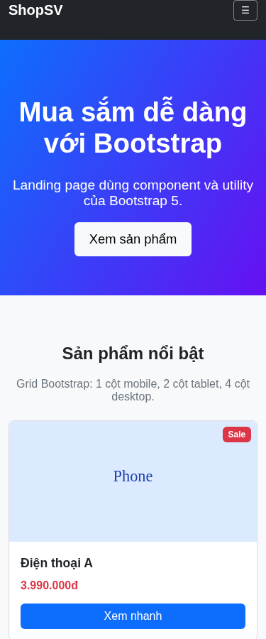
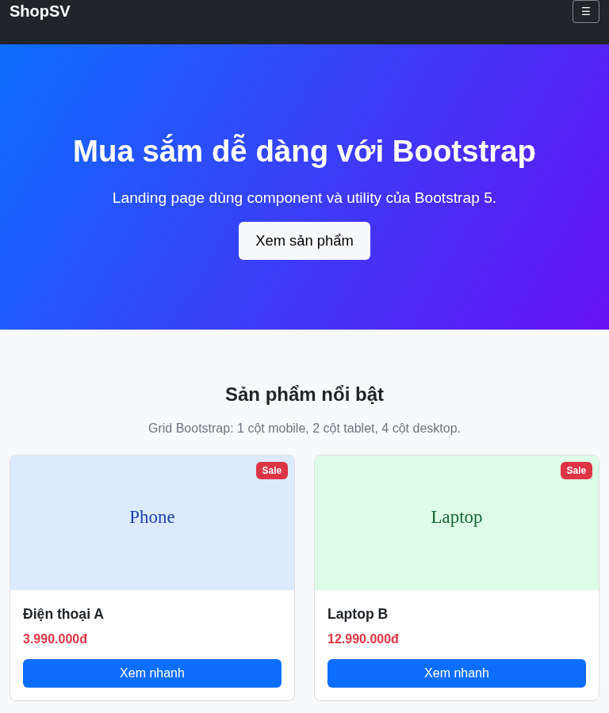
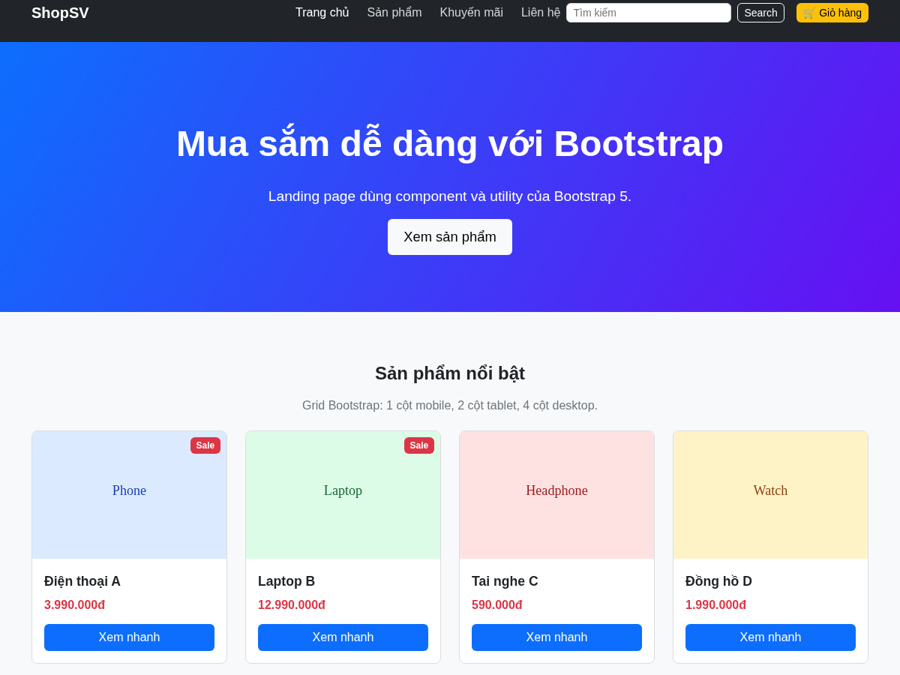
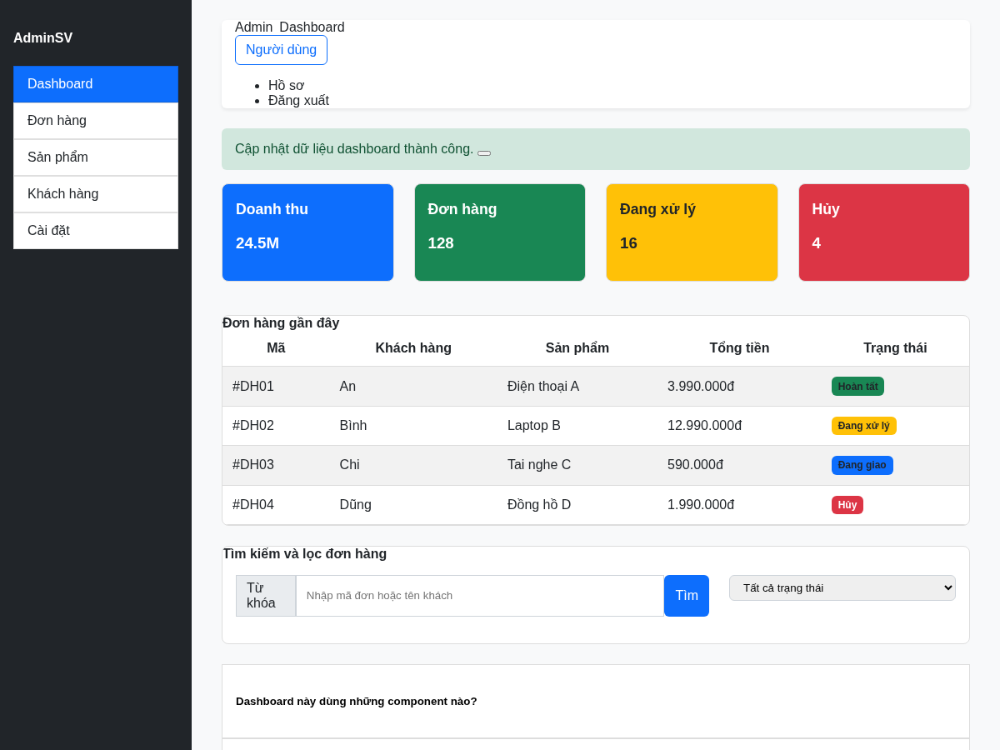

# PHIẾU BÀI TẬP 06 — CSS FRAMEWORKS

## Track chọn: Bootstrap 5

Em chọn Track A — Bootstrap 5 vì Bootstrap có sẵn grid system, components và utilities nên làm layout responsive nhanh hơn so với CSS thuần.

---

# PHẦN A — ĐỌC HIỂU

## Câu A1 — Grid System

Đoạn HTML đề bài:

```html
<div class="container">
    <div class="row">
        <div class="col-12 col-md-6 col-lg-3">Box 1</div>
        <div class="col-12 col-md-6 col-lg-3">Box 2</div>
        <div class="col-12 col-md-6 col-lg-3">Box 3</div>
        <div class="col-12 col-md-6 col-lg-3">Box 4</div>
    </div>
</div>
```

Bootstrap chia 1 hàng thành 12 cột. Mỗi class `col-*` sẽ quyết định phần tử chiếm bao nhiêu cột ở từng breakpoint.

| Kích thước màn hình | Class hoạt động chính | Số cột mỗi hàng | Bố cục |
|---|---|---|---|
| `< 768px` | `col-12` | 1 cột | Mỗi box chiếm hết 12/12 cột |
| `768px - 991px` | `col-md-6` | 2 cột | Mỗi box chiếm 6/12 cột |
| `≥ 992px` | `col-lg-3` | 4 cột | Mỗi box chiếm 3/12 cột |

### Sơ đồ layout

Mobile `< 768px`:

```text
┌──────────────┐
│    Box 1     │
├──────────────┤
│    Box 2     │
├──────────────┤
│    Box 3     │
├──────────────┤
│    Box 4     │
└──────────────┘
```

Tablet `768px - 991px`:

```text
┌───────┬───────┐
│ Box 1 │ Box 2 │
├───────┼───────┤
│ Box 3 │ Box 4 │
└───────┴───────┘
```

Desktop `≥ 992px`:

```text
┌───────┬───────┬───────┬───────┐
│ Box 1 │ Box 2 │ Box 3 │ Box 4 │
└───────┴───────┴───────┴───────┘
```

### Câu hỏi thêm

`col-md-6` nghĩa là từ breakpoint `md` trở lên, phần tử chiếm 6/12 cột, tức là nửa hàng.

Không cần viết `col-sm-12` vì đã có `col-12`. Class `col-12` áp dụng từ màn hình nhỏ nhất trở lên. Sau đó khi tới `md` hoặc `lg`, các class `col-md-6`, `col-lg-3` sẽ ghi đè lại layout.

---

## Câu A2 — Utilities & Components

### 1. Giải thích `d-none d-md-block`

```html
<div class="d-none d-md-block">Nội dung</div>
```

- `d-none`: ẩn element ở mọi kích thước mặc định.
- `d-md-block`: từ màn hình `md` trở lên thì hiển thị lại dạng block.

Vậy element sẽ:

- Ẩn trên mobile nhỏ hơn `768px`.
- Hiện từ tablet `768px` trở lên.

### 2. Một số spacing utilities

| Class | Ý nghĩa |
|---|---|
| `mt-3` | margin-top mức 3 |
| `mb-4` | margin-bottom mức 4 |
| `ms-2` | margin-left/start mức 2 |
| `px-4` | padding trái và phải mức 4 |
| `py-5` | padding trên và dưới mức 5 |
| `me-auto` | margin-right/end auto, hay dùng để đẩy phần tử còn lại sang bên |
| `mb-auto` | margin-bottom auto |

Ví dụ:

```html
<div class="mt-3 px-4 py-2">Nội dung có margin và padding</div>
```

### 3. Sự khác nhau giữa `.container`, `.container-fluid`, `.container-md`

| Class | Ý nghĩa |
|---|---|
| `.container` | Có `max-width` theo từng breakpoint, căn giữa nội dung |
| `.container-fluid` | Luôn rộng 100% màn hình |
| `.container-md` | Trước breakpoint `md` thì rộng 100%, từ `md` trở lên thì giống container có giới hạn |

Em thường dùng:

- `.container` cho nội dung chính của website.
- `.container-fluid` cho layout cần full width.
- `.container-md` khi muốn mobile full width nhưng tablet/desktop có giới hạn chiều rộng.

---

# PHẦN B — THỰC HÀNH

## Bài B1 — Landing Page Bootstrap

File đã tạo:

```text
bootstrap_landing.html
```

Trang có các phần chính:

- Navbar responsive dùng `navbar navbar-expand-lg`.
- Hero carousel có 3 slides.
- Product grid dùng `row`, `col-12`, `col-md-6`, `col-lg-3`.
- Product card dùng `card`, `card-img-top`, `card-body`, `card-title`, `card-text`.
- Badge Sale dùng `badge bg-danger`.
- Modal xem nhanh dùng Bootstrap modal.
- Footer 4 cột dùng grid.

Ảnh kiểm chứng responsive:







## Bài B2 — Dashboard Layout

File đã tạo:

```text
bootstrap_dashboard.html
```

Trang dashboard có:

- Sidebar cố định bên trái.
- Topbar có breadcrumb và dropdown user.
- 4 stat cards.
- Table đơn hàng giả.
- Form tìm kiếm và filter.
- Accordion FAQ.
- Alert thông báo thành công.

Ảnh kiểm chứng:



---

# PHẦN C — PHÂN TÍCH

## Câu C1 — Tùy biến Bootstrap

Nếu muốn đổi màu `$primary` của Bootstrap từ màu xanh mặc định sang `#E63946`, em sẽ làm bằng SASS variables.

Quy trình cơ bản:

1. Cài Bootstrap bằng npm:

```bash
npm install bootstrap
```

2. Tạo file SCSS riêng, ví dụ `custom.scss`.

3. Khai báo biến trước khi import Bootstrap:

```scss
$primary: #E63946;

@import "../node_modules/bootstrap/scss/bootstrap";
```

4. Compile SCSS ra CSS:

```bash
sass custom.scss custom.css
```

5. Link file `custom.css` vào HTML.

### Vì sao không nên override trực tiếp `.btn-primary`?

Nếu viết CSS kiểu:

```css
.btn-primary {
    background: red;
}
```

thì chỉ sửa được một vài chỗ cụ thể. Trong Bootstrap, màu `primary` không chỉ xuất hiện ở button mà còn ở nhiều component khác như alert, badge, link, border, form focus,... Nếu override thủ công sẽ dễ bị thiếu chỗ và giao diện không đồng bộ.

Dùng SASS variables tốt hơn vì chỉ cần đổi biến `$primary`, sau đó Bootstrap tự tạo lại toàn bộ class liên quan theo màu mới.

---

## Câu C2 — So sánh CSS thuần và Bootstrap

### CSS thuần tạo navbar responsive + product card

```html
<nav class="navbar">
    <div class="logo">ShopSV</div>
    <button class="menu-btn">☰</button>
    <ul class="menu">
        <li><a href="#">Trang chủ</a></li>
        <li><a href="#">Sản phẩm</a></li>
        <li><a href="#">Liên hệ</a></li>
    </ul>
</nav>

<div class="product-card">
    
    <h3>Điện thoại A</h3>
    <p>3.990.000đ</p>
    <button>Mua</button>
</div>
```

```css
.navbar {
    display: flex;
    justify-content: space-between;
    align-items: center;
    padding: 16px;
    background: #222;
    color: white;
}

.menu {
    display: none;
    list-style: none;
    gap: 20px;
}

.menu a {
    color: white;
    text-decoration: none;
}

.product-card {
    border: 1px solid #ddd;
    border-radius: 8px;
    padding: 16px;
    background: white;
}

.product-card img {
    width: 100%;
    border-radius: 8px;
}

.product-card p {
    color: red;
    font-weight: bold;
}

.product-card button {
    width: 100%;
    padding: 10px;
    background: #0d6efd;
    color: white;
    border: 0;
    border-radius: 6px;
}

@media (min-width: 768px) {
    .menu {
        display: flex;
    }

    .menu-btn {
        display: none;
    }
}
```

### Bootstrap version

```html
<nav class="navbar navbar-expand-lg navbar-dark bg-dark">
    <div class="container">
        <a class="navbar-brand" href="#">ShopSV</a>
        <button class="navbar-toggler" data-bs-toggle="collapse" data-bs-target="#menu">
            <span class="navbar-toggler-icon"></span>
        </button>
        <div class="collapse navbar-collapse" id="menu">
            <ul class="navbar-nav ms-auto">
                <li class="nav-item"><a class="nav-link" href="#">Trang chủ</a></li>
                <li class="nav-item"><a class="nav-link" href="#">Sản phẩm</a></li>
            </ul>
        </div>
    </div>
</nav>

<div class="card">
    
    <div class="card-body">
        <h5 class="card-title">Điện thoại A</h5>
        <p class="card-text text-danger fw-bold">3.990.000đ</p>
        <button class="btn btn-primary w-100">Mua</button>
    </div>
</div>
```

### Bảng so sánh

| Tiêu chí | CSS thuần | Bootstrap |
|---|---|---|
| Số dòng CSS | Nhiều hơn, phải tự viết layout và responsive | Ít hơn vì dùng class có sẵn |
| Thời gian phát triển | Lâu hơn | Nhanh hơn |
| Khả năng tùy biến | Tự do hơn | Bị ảnh hưởng bởi phong cách Bootstrap |
| Tính đồng bộ | Phụ thuộc người viết CSS | Đồng bộ sẵn giữa components |
| Dễ học ban đầu | Dễ hiểu nếu đã biết CSS | Cần nhớ nhiều class |

### Khi nào nên dùng Bootstrap?

Nên dùng Bootstrap khi:

- Cần làm giao diện nhanh.
- Làm dashboard, landing page, form, modal, table.
- Dự án nhỏ hoặc bài tập cần responsive nhanh.
- Nhóm muốn dùng component có sẵn để code thống nhất.

### Khi nào không nên dùng Bootstrap?

Không nên dùng Bootstrap khi:

- Website cần giao diện quá riêng, khác hoàn toàn phong cách Bootstrap.
- Muốn tối ưu từng dòng CSS thật nhẹ.
- Dự án yêu cầu design system riêng rất chi tiết.
- Người viết chỉ copy class mà không hiểu CSS bên dưới.
