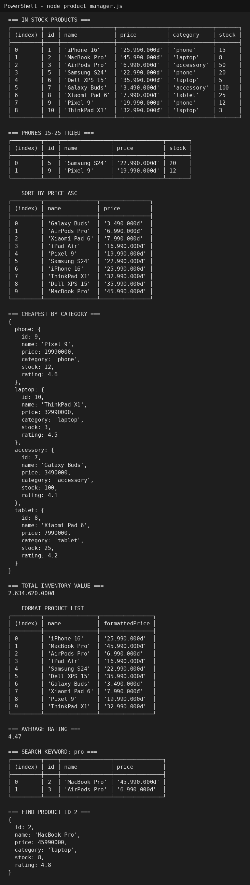
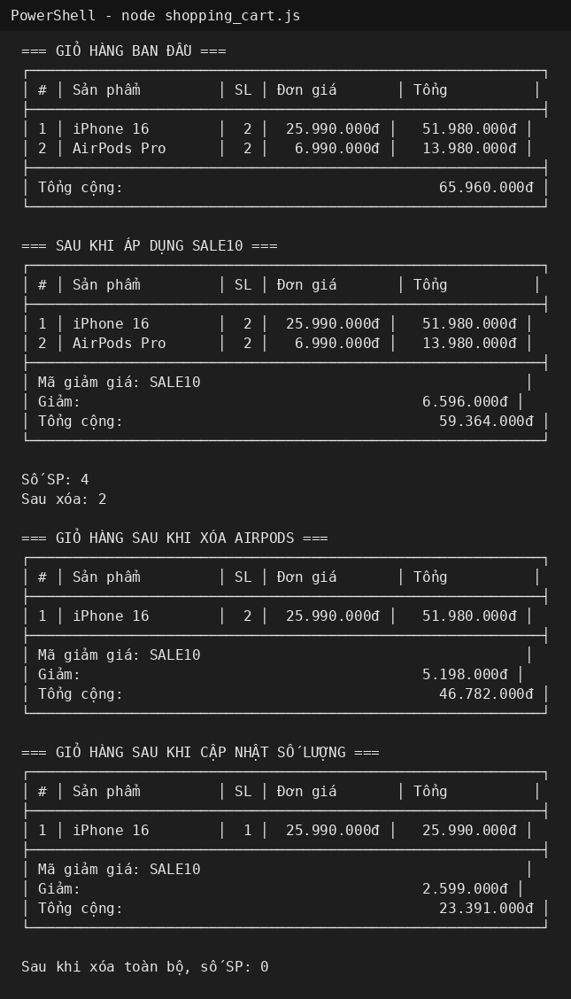
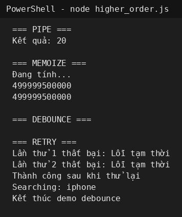

# PBT_08 - JavaScript Functions, Arrays & Objects

## PHẦN A - KIỂM TRA ĐỌC HIỂU

### Câu A1 - Function Declaration vs Expression vs Arrow

#### Function Declaration

```javascript
function tinhThueBaoHiem(luong) {
    const thue = luong > 11000000 ? luong * 0.1 : 0;

    return {
        thuong: thue,
        thuc_nhan: luong - thue
    };
}

console.log(tinhThueBaoHiem(15000000));
```

#### Function Expression

```javascript
const tinhThueBaoHiem = function(luong) {
    const thue = luong > 11000000 ? luong * 0.1 : 0;

    return {
        thuong: thue,
        thuc_nhan: luong - thue
    };
};

console.log(tinhThueBaoHiem(15000000));
```

#### Arrow Function

```javascript
const tinhThueBaoHiem = (luong) => {
    const thue = luong > 11000000 ? luong * 0.1 : 0;

    return {
        thuong: thue,
        thuc_nhan: luong - thue
    };
};

console.log(tinhThueBaoHiem(15000000));
```

Ba cách viết hàm này khác nhau về hoisting.

Function Declaration có thể được gọi trước khi khai báo:

```javascript
console.log(tinhThueBaoHiem(15000000));

function tinhThueBaoHiem(luong) {
    const thue = luong > 11000000 ? luong * 0.1 : 0;
    return {
        thuong: thue,
        thuc_nhan: luong - thue
    };
}
```

Function Expression và Arrow Function thường được gán vào biến `const` hoặc `let`, nên không thể gọi trước khi khai báo:

```javascript
console.log(tinhThueBaoHiem(15000000));

const tinhThueBaoHiem = function(luong) {
    const thue = luong > 11000000 ? luong * 0.1 : 0;
    return {
        thuong: thue,
        thuc_nhan: luong - thue
    };
};
```

Đoạn trên sẽ lỗi vì biến `tinhThueBaoHiem` chưa được khởi tạo trước khi sử dụng.

---

### Câu A2 - Scope & Closure

#### Đoạn 1

```javascript
console.log(c.increment());  // 1
console.log(c.increment());  // 2
console.log(c.increment());  // 3
console.log(c.decrement());  // 2
console.log(c.getCount());   // 2
```

Hàm `counter()` tạo ra biến `count`. Các hàm `increment`, `decrement`, `getCount` vẫn nhớ và dùng được biến `count` sau khi `counter()` đã chạy xong. Đây là closure.

#### Đoạn 2

Kết quả sau khi chạy:

```text
var: 3
var: 3
var: 3
let: 0
let: 1
let: 2
```

Với `var`, biến `i` có phạm vi function scope nên các lần lặp dùng chung một biến. Khi `setTimeout` chạy thì vòng lặp đã kết thúc, lúc đó `i` bằng 3.

Với `let`, biến `j` có phạm vi block scope. Mỗi vòng lặp tạo ra một giá trị `j` riêng nên kết quả lần lượt là 0, 1, 2.

---

### Câu A3 - Array Methods

```javascript
const nums = [1, 2, 3, 4, 5, 6, 7, 8, 9, 10];

const evenNumbers = nums.filter(n => n % 2 === 0);

const tripleNumbers = nums.map(n => n * 3);

const total = nums.reduce((sum, n) => sum + n, 0);

const firstGreaterThanSeven = nums.find(n => n > 7);

const hasGreaterThanTen = nums.some(n => n > 10);

const allGreaterThanZero = nums.every(n => n > 0);

const descriptions = nums.map(n => `Số ${n} là ${n % 2 === 0 ? "chẵn" : "lẻ"}`);

const reversed = [...nums].reverse();
```

Kết quả:

```text
[2, 4, 6, 8, 10]
[3, 6, 9, 12, 15, 18, 21, 24, 27, 30]
55
8
false
true
["Số 1 là lẻ", "Số 2 là chẵn", ...]
[10, 9, 8, 7, 6, 5, 4, 3, 2, 1]
```

---

### Câu A4 - Object Destructuring & Spread

```javascript
const { name, price, specs: { ram, color } } = product;
console.log(name, price, ram, color);
```

Kết quả:

```text
iPhone 16 25990000 8 Titan
```

Dòng sau:

```javascript
console.log(specs);
```

Kết quả:

```text
ReferenceError
```

Lý do là khi destructuring `specs: { ram, color }`, JavaScript chỉ lấy `ram` và `color`, không tạo biến tên `specs`.

Phần Spread:

```javascript
const updated = { ...product, price: 23990000, sale: true };
console.log(updated.price);            // 23990000
console.log(updated.sale);             // true
console.log(product.price);            // 25990000
```

Object gốc `product` không bị đổi ở thuộc tính `price`.

Phần Spread gotcha:

```javascript
const copy = { ...product };
copy.specs.ram = 16;
console.log(product.specs.ram);        // 16
```

Kết quả là `16` vì spread object chỉ copy nông. Thuộc tính `specs` là object lồng bên trong nên `copy.specs` và `product.specs` vẫn cùng tham chiếu tới một object.


## PHẦN B - MINH CHỨNG KẾT QUẢ THỰC HÀNH

### Bài B1 - Quản lý Sản phẩm E-Commerce

Kết quả chạy file `product_manager.js`:



### Bài B2 - Giỏ hàng Shopping Cart

Kết quả chạy file `shopping_cart.js`:



### Bài B3 - Higher-Order Functions Challenge

Kết quả chạy file `higher_order.js`:



---

## PHẦN C - SUY LUẬN

### Câu C1 - Refactor Code

```javascript
const processOrders = orders =>
    orders
        .filter(({ status, total }) => status === "completed" && total > 100000)
        .map(({ id, customer, total }) => {
            const discount = total * 0.1;
            return { id, customer, total, discount, finalTotal: total - discount };
        })
        .sort((a, b) => b.finalTotal - a.finalTotal);
```

Code sau khi refactor ngắn hơn và dễ đọc hơn. `filter` dùng để lọc đơn hàng đã hoàn thành và có tổng tiền lớn hơn 100000. `map` dùng để tạo object mới có thêm giảm giá và tổng cuối. `sort` dùng để sắp xếp theo `finalTotal` giảm dần.

---

### Câu C2 - Thiết kế API

```javascript
const miniArray = {
    map(arr, fn) {
        const result = [];

        for (let i = 0; i < arr.length; i++) {
            result.push(fn(arr[i], i, arr));
        }

        return result;
    },

    filter(arr, fn) {
        const result = [];

        for (let i = 0; i < arr.length; i++) {
            if (fn(arr[i], i, arr)) {
                result.push(arr[i]);
            }
        }

        return result;
    },

    reduce(arr, fn, initialValue) {
        let accumulator = initialValue;
        let startIndex = 0;

        if (accumulator === undefined) {
            accumulator = arr[0];
            startIndex = 1;
        }

        for (let i = startIndex; i < arr.length; i++) {
            accumulator = fn(accumulator, arr[i], i, arr);
        }

        return accumulator;
    }
};

console.log(miniArray.map([1, 2, 3], x => x * 2));
console.log(miniArray.filter([1, 2, 3, 4], x => x > 2));
console.log(miniArray.reduce([1, 2, 3, 4], (a, b) => a + b, 0));
```

Kết quả:

```text
[2, 4, 6]
[3, 4]
10
```
